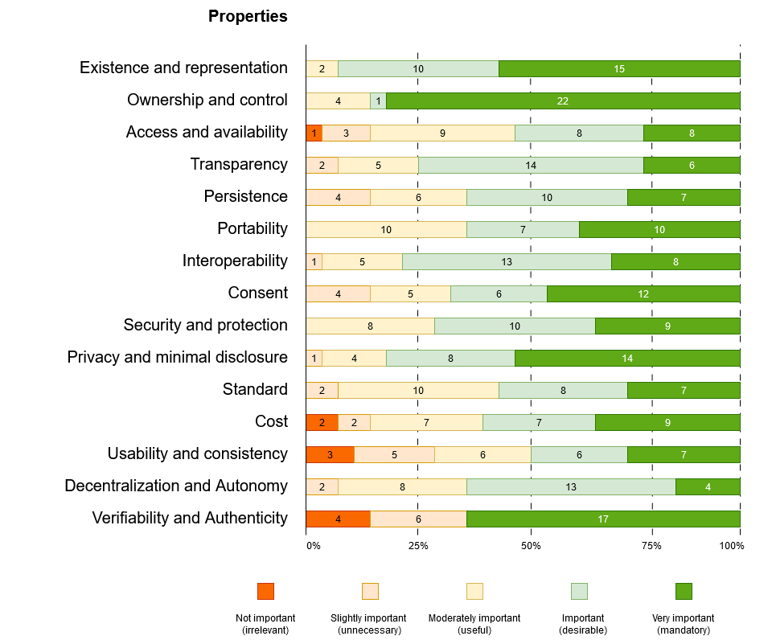
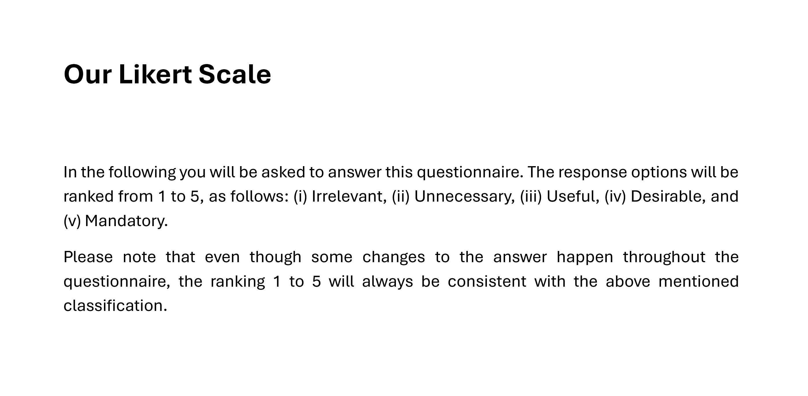

# 1. Self-Sovereign Identity

Self-Sovereign Identity (SSI) is an innovative approach to identity management that empowers users with full control over their identities. Beyond control, SSI encompasses several fundamental principles. The first to define a set of principles was Allen[^allen], and since then, academics and working groups have contributed to expanding this list to create a more comprehensive framework. Some of the key features of SSI include *Existence, Control, Access, Transparency, Persistence, Portability, Interoperability, Consent, Minimalization, and Protection.*

## 1.1 Background

Figure 1 illustrates the flow of identity information and key roles within the SSI model. Data moves from left to right, with issuers providing data to holders, who collect claims and later present them as assertions to service providers. Assertions may consist of claims combined in various ways and formats. The roles within the data flow are not fixed; each entity can act as an issuer or a verifier depending on the context. For example, the holder may occasionally issue claims to the verifier, while the verifier can also issue claims to holders upon request. In some cases, a verifiable data registry, such as a blockchain registry or a certificate authority (CA), can be integrated into the model, as shown in Figure 1.

The same figure systematically positions Allen's principles within the Users and Roles schema and the data flow. Specifically, the data flow on the right integrates information from [^cucko], the Trust Over IP Foundation [^toip], and the Architecture and Reference Framework v1.4.1 of the EUDI Wallet solution [^ARF] to build the most comprehensive model possible for the SSI data flow. The use of a registering CA—or another form of centrally managed or decentralized repository—can be replaced with a different type of trust anchor to validate certificates.

*Figure 1: Systematic positioning of Allen's properties within the SSI process workflow.[^allen]*

## 1.2 Related works

Several works by academics and industry leaders have experimenting and extended with Allen's principles in the attempt to converge to a comprehensive set of properties for SSI. However, past contributions have shown a significant disagreement on the definition and categorization of principles across authors. Among the first to provide a new list of principles was Andrieu who considered a social analysis of SSI~\cite{JoeAndrieu2016, gilani2020survey}, with later technical considerations~\cite{ferdous2019search}. Subsequent columns present a taxonomy of principles from other papers, where each row reports the name of the taxonomy that the corresponding principle in the first column belongs. The paired principle is in the first column, same row. For example, the Sovrin Foundation (second column) gathered principles into a three-way taxonomy of Control, Portability, and Security (2016)~\cite{tobin2016inevitable}. Control is a category that contains the principles of Existence, Control, Persistence, and Consent. Indeed, each instance of Control in the second column matches the principles in the first column: Existence, Control, Persistence, and Consent. In the same way, Portability is a category that includes the principles of Access, Transparency, Portability, and Interoperability. Finally, Security consists of Persistence, Protection, and Minimization. One principle may pertain to several categories (e.g., Persistence). Thereof, the same approach is for the remaining works. Andrieu provided a tech-free categorization with Control, Acceptance, and Costs (2016)~\cite{JoeAndrieu2016}. Other papers extend principles to cover blockchain-based e-identity systems (2019)~\cite{ferdous2019search} and add Validity as a further security property (2020)~\cite{gilani2020survey}. Sheldrake considers only essential principles of Self (2019)~\cite{Sheldrake2019}. Lastly, a business-oriented analysis emphasizes Personal Data, Control, and Usability (2022)~\cite{BlockTechDiVer}.

## 1.3 Methodology

The process that led to the selection of the final list of properties is fully replicable. Initially, we selected 52 properties from 18 works, using heuristics to focus on a subset of principles in our final list. We further categorized these properties through a clustering algorithm and proposed a questionnaire to experts in the Decentralized and Self-Sovereign Identity community participating in the ARES 2024 conference. The questionnaire aimed to: I) Investigate the identified SSI properties and assess their importance. II) Identify the most and least critical properties, including non-repudiable ones. III) Validate the classification and grouping of properties.

To gather relevant articles and refine our principles, we conducted a systematic review, which provides a structured overview of a research field by adapting the steps presented in [^lepore][^badzek][^cushman].

*1. Defining research questions.* We formulated the research question RQ1: *What are the principles of Self-Sovereign Identity?* From RQ1, we derived the following keywords:

- *"Self-Sovereign Identity" AND "principles"*

To optimize search results and avoid wildcards, the keywords were refined; for instance, Self-Sovereign Identity was sometimes replaced with SSI. We used principles and properties interchangeably.[^lepore] Finally, the keywords were rearranged to ensure comprehensive coverage of the research scope.

*2. Searching.* Search strings were used to retrieve relevant papers from databases, including ACM, ArXiv, IEEE Xplore, Scopus, and the meta-search engine Google Scholar. This process initially yielded 47 results.

*3. Screening.* Abstracts and conclusions were reviewed to exclude irrelevant results, particularly those not addressing SSI principles. Papers that did not explain the methodology for system analysis were also removed, along with duplicate entries. The final selection consists of 18 papers. Despite being an emerging topic, this selection represents a significant portion of the literature on SSI principles from 2016 to 2024.

*4. Recording of properties.* The selected articles were analyzed to extract 52 property labels as presented by the authors. The results were compiled into a table that lists the papers along with their corresponding features for SSI.

*5. Merge and selection.* Some properties had similar meanings but were labeled differently across various papers. To minimize subjectivity, we first reviewed past literature to consolidate labels representing identical properties, adopting the names suggested by previous studies. This approach allowed us to create a list that aligns with established terminology in the field of identity. We then applied heuristics to extract the most relevant properties, resulting in a list of 15 principles.

*6. Clustering.* The property labels were clustered using various methods, including K-Means, Greedy (local), and Graph Theory. We compared and discussed the rationale behind the number of clusters and their names.

*7. Definition of principles.* We summarized the definitions of properties, shortening them as much as possible while retaining their essence.

*8. Expert validation.* We proposed a questionnaire to experts in the field of decentralized identity to validate the final list of properties and refine their definitions.

*9. Final list.* The final step involved creating an agreed-upon list of properties, accompanied by precise definitions for each.

Figure shows the process to validate properties.

*Figure 1. The process of our literature review. Squares putlines the main process. Rounded squares are outputs. They intertwine in a process where the output feeds the next step.*

Steps 1 to 3 have already been detailed in the list. Therefore, we will now focus on explaining the remaining steps.

### 1.3.1 Recording of properties

Table 1 summarizes the names of the properties and contributions identified through the search and screening process. The rows represent contributions, while the columns correspond to the principle labels established by each author. Notably, some works propose alternative sets of principles, and variations in naming conventions can be observed across different authors. Our literature review examined a total of 18 relevant works in the field of identity, covering 52 properties. The checkmarks indicate the properties addressed by the respective author(s).

[Click to view the table 1.](https://cristianlepore.github.io/Self-Sovereign-Identity/definition/tables/principles/Principles1.html) *Comparison of identified properties in various sources.*
[Table 1 alternative version.](https://cristianlepore.github.io/Self-Sovereign-Identity/definition/tables/principles/Principles2.html) 

### 1.3.2 Merge and selection

Differences in the naming of properties across various authors can be observed. However, many of these properties convey the same or similar meanings. To avoid pitfalls and subjective merging of labels, we have consolidated property labels based on previous works by [^cucko][^sovrin][^toth][^stokkink][^ferdous][^andrieu]. This resulted in the following merges: (i) Existence and Representation, (ii) Ownership and Control, (iii) Ownership and Choosability, (iv) Access and Availability, (v) Portability and Secure Identity Transfer, (vi) Interoperability and Compliance, (vii) Consent and Participation, (viii) Protection and Secure Transactions, (ix) Protection and Security, (x) Protection and Counterfeit Prevention, (xi) Minimization and Privacy, (xii) Minimization and Disclosure Minimization, (xiii) Usability and Consistency, (xiv) Consistency and Recoverability, (xv) Decentralization and Autonomy, (xvi) Provability and Identity Assurance, (xvii) Provability, Verifiability, and Authentication, and (xviii) Identity Assurance and Identity Verification.

This approach aligns our list with established terminology in the field of identity, ensuring that the names for the final list of properties correspond to combinations of labels used in the referenced papers. Additionally, we slightly adjusted the work of [^cucko] to reflect updates in our literature review. Specifically, we removed the properties of Equity and Inclusion, as well as Recoverability. Furthermore, we renamed Legacy System with Compliance; we eliminated the links between Control and Agency, Access and Usability, and Availability and Recoverability. Figure 2 visualizes the results through a Causal Loop Diagram based on these papers. This diagram includes only the properties that have been modified or merged, while the complete list of properties, as presented in [Table 1](https://cristianlepore.github.io/Self-Sovereign-Identity/definition/tables/principles/Principles1.html), is omitted for clarity.

*Figure 2: Casual loop diagram of the set of properties, defined by different authors on the left. The final set of properties on the right.*

[Table 2](https://cristianlepore.github.io/Self-Sovereign-Identity/definition/tables/principles_semplification/Principles_semplification2.html) shows the entire list of properties, the one that we have merged, and the others, with, when needed, their new names. The merging process has shrinked the initial list by a 34%, leading to a total of 34 principles, still a high number for a summary of properties.

Additionally, [Table 2](https://cristianlepore.github.io/Self-Sovereign-Identity/definition/tables/principles_semplification/Principles_semplification2.html) shows that Allen's principles are generally shared by 80% of authors, while the remaining 24 principles are shared by less than 10% of authors. This means that, on average, each of these principles, apart from Allen's principles, is shared by fewer than three authors.

[Click to view the table 2.](https://cristianlepore.github.io/Self-Sovereign-Identity/definition/tables/principles_semplification/Principles_semplification2.html) *Comparison of identified properties grouping from various sources*

| **Category**                          | **Adoption Rate** | **Details**                                      |
|---------------------------------------|-------------------|-------------------------------------------------|
| Authors adopting Allen's principles   | ≈ 80%  | Share an average of 8 out of 10 SSI principles. |
| Remaining principles (24 total)       | < 10%  | Share an average of 2 out of 24 principles. |

We use these findings to support our rationale and define a final set of principles for SSI. To achieve this, we selected principles from [Table 2](https://cristianlepore.github.io/Self-Sovereign-Identity/definition/tables/principles_semplification/Principles_semplification2.html) that are cited by at least five authors, representing at least 25% of the total. The final list includes 15 principles, grouped as follows: 10 principles from Allen's original work and 5 principles from extended contributions. Additionally, we can analyze some further numbers: 19 out of the 34 principles - and 19 out of the 24 extended principles - were cited by fewer than five authors. Notably, the majority of these 19 principles were shared on avarage by two authors. Our final list is reported in [Table 3](https://cristianlepore.github.io/Self-Sovereign-Identity/definition/tables/principles_semplification/Principles_semplification1.html).

[Click to view the table 3.](https://cristianlepore.github.io/Self-Sovereign-Identity/definition/tables/principles_semplification/Principles_semplification1.html) *Our final list of properties and their respective names.*

### 1.3.3 Clustering

A relevant question is: can we cluster labels to create categories? In the context of SSI properties, categorization is useful to "illuminate a relationship between the subjects and objects of knowledge."[^mahalakshmi] In this regard, we aimed to provide a categorization of works that illustrates their relationship with Self-Sovereign Identity. Some of the previously cited works have already clustered principles, as discussed in [Related Works](#12-related-works). To build on this, we gathered further information about their categorization of principles and reported it in [Table 4](https://cristianlepore.github.io/Self-Sovereign-Identity/definition/tables/principles_classification/Principles_classification1), where differences in naming conventions among authors can be observed.

[Click to view the table 4.](https://cristianlepore.github.io/Self-Sovereign-Identity/definition/tables/principles_classification/Principles_classification1) *The categorization of principles provided by various authors.*

To better illustrate the relationship between properties and key aspects of SSI, we created five groups of principles based on past definitions. We applied heuristics from previous works to guide our clustering process. The resulting table is presented in the first sheet of the [Excel file](https://cristianlepore.github.io/Self-Sovereign-Identity/definition/tables/principles_classification/Summary.xlsx).
In this table, rows represent the 15 properties, columns correspond to the categorization of principles from [Table 4](https://cristianlepore.github.io/Self-Sovereign-Identity/definition/tables/principles_classification/Principles_classification1), and cell numbers indicate occurrences by author. We employed three clustering techniques: Greedy, K-Means, and Graph Theory.

**Clustering techniques**

1) Greedy models iteratively select the locally optimal solution, minimizing the distance between clusters. The process begins by selecting the column from the [excel file](https://cristianlepore.github.io/Self-Sovereign-Identity/definition/tables/principles_classification/Summary.xlsx) (second sheet) with the highest number of occurrences and grouping rows that minimize the distance from that column. The Greedy approach has the advantage that is easy to use and simple. Despite its simplicity, it does not always guarantee a globally optimal solution because part of the result depend from the starting point. If not properly chosed, the local optimal does not coincide with the global optimal. Therefor, when multiple categories have the same number of instances, it is essential to minimize the distance between clusters by considering multiple categories.

2) K-Means aims to minimize intra-cluster distances. Graphically, it initializes a centroid at a random point on the chart and iteratively adjusts to find the nearest points. The number of centroids, K, significantly affects the result. We automate the process through the following steps: [Python Program](https://cristianlepore.github.io/Self-Sovereign-Identity/definition/program/Compute_K-Means.py) whose main steps are as follows:

- The program reads data from a CSV file 
`data = pd.read_csv(file_path)`
- Fills black cells with zeroes 
`cleaned_data = numerical_columns.fillna(0)`
- Applies the K-Means clustering 
`kmeans = KMeans(n_clusters=n_clusters, init='k-means++', random_state=42)` with a pre-established value `K=5`
For reproducibility of results, we used the same seed to calculate the starting centroid through `random_state=42`
We tested several combinations of parameter K (number of clusters) and eventually settled on `K=5`. This value of K ensures a fair number of elements in each cluster.
- Write output and save results. `print(f"Clustering completed! Results saved in: {output_file}")`

3) Graph theory represents points as vertices connected by edges. The edges are weighted based on the number of instances of articles from authors. For example, if three articles use the category 'Controllability,' the corresponding edge will have a weight of three. While this method is visually appealing and easy to understand, it does not scale well to hundreds of nodes.

Figure 3 shows the final result of our grouping process. The group's name is derived from the literature.

*Figure 3: The final grouping.*

### 1.3.4 Definition of principles

We have combined the definitions of principles from 18 works, condensing them for quick comprehension while preserving their essence. This merging was done by referring to the authors' definitions as summarized in [Table 2](https://cristianlepore.github.io/Self-Sovereign-Identity/definition/tables/principles_semplification/Principles_semplification2.html). By combining definitions from at least two authors, we aimed to give a concise defintion. In some cases, we encountered similar definitions from more than two authors. To ensure consistency during the merging phase, we used uniform wording and synonyms. For example, we standardized the terms "users", "individuals", and roles like "holder" by referring to them as "entities."

| Property | Definition |
|----------|----------|
| Existence and Representation | Entities must be able to verify their existence by presenting attributes to service providers and generating multiple identities as needed.[^allen][^sheldrake] |
| Consent | Entities must provide explicit consent for the collection, use, and sharing of their identity data, with the option to opt in or opt out at a later time.[^cucko][^allen] |
| Ownership and Control | Entities must have full control and ultimate ownership of their self-sovereign identity. This includes secure algorithms that maintain the validity of the identity and its claims, whether self-asserted or issued by a third party.[^allen][^ferdous] | 
| Security and Protection | The security of an identity and its related communication is paramount for any SSI solution. The system must prioritizing censorship-resistant methods that promote individual rights and freedom through cryptographically secure connections and communications.[^naik][^pava] | 
| Persistence | Identities must be long-lived. A self-sovereign identity must ensuring that identities endure for as long as needed by the owner.[^pava][^allen] |
| Privacy and Minimal Disclosure | The SSI solution should not include any method for associating biometric data with an underlying identity. Personal and confidential identity-related data should only be shared with the owner’s consent, and only the minimum necessary information should be shared with third parties.[^naik][^toth] | 
| Access and Availability | Identity must always be available to entities, which in turn must have unrestricted access to their identity information. Entities should be able to retrieve all information, including claims and assertions.[^ferdous][^tobin] | 
| Transparency | Systems and algorithms must be transparent.[^stokkink] The systems used to manage and operate a network of identities should be open, both in terms of their functionality and in how they are managed and updated.[^allen] |
| Portability | Identities must be portable. Entities should be able to securely transfer or move their identity data to agents or systems of their choice.[^cucko][^glockler] |
| Interoperability | Identities  should  be  as  widely  usable as possible.[^stokkink] The systems shall enable digital identity data for an entity to be represented, exchanged, secured, protected, and verified interoperably.[^toip][^allen] | 
| Cost | An identity should be provided to general users free of charge, with no hidden costs, licensing fees, or other financial charges.[^naik] Any proposed standard for self-sovereign identity must be adoptable at an extremely low cost.[^andrieu] | 
| Standard | A self-sovereign identity must be based onopen standards to ensure maximum portability,[^cucko] interoperability and adoption as well as sustainability.[^ferdous] | 
| Decentralization and Autonomy | A Self-Sovereign Identity must enable complete autonomy in managing and administering identity information, without relying on a centralized system to represent, control, or verify an entity's digital identity data.[^sovrin][^essif][^ferdous] | 
| Verifiability and Authenticity | Entities should be able to reliably prove their identity.[^cucko] Any identity should be verifiable through its credentials on the Web, in a manner similar to how a physical credential represents a real-world identity.[^naik] |
| Usability and Consistency | Entities should be able to count on a consistent experience across various technology platforms and services, with the system prioritizing the usability and accessibility of agents and other SSI components.[^satybaldy][^sovrin] |

### 1.3.5 Expert validation

To validate the proposed principles, we conducted a survey targeting experts in the field of decentralized and Self-Sovereign Identity. The experts were approached in person during the ARES Conference 2024, held from July 29 to August 2 in Vienna, Austria. The purpose was to gain a broader understanding of the perception of the SSI concept and its associated properties. Specifically, we invited respondents to complete an online questionnaire to: I) Investigate the identified SSI properties and their importance. II) Identify the most and least critical properties, including non-repudiable ones. III) Validate the classification and grouping of properties. The survey aimed to assess the perceived importance of these properties, highlighting the most and least critical ones. Additionally, by gathering expert insights, we sought to uncover any overlooked concerns, inconsistencies, misunderstandings, or missing properties in our analysis.

**Methodology**
The ARES Conference hosted the *International Workshop on Emerging Digital Identities**.[^ares] At the entrance to the hall, just before the keynote on identity and Self-Sovereign Identity started, a QR code was distributed to participants. By following the link, on a voluntary basis, participants were invited to electronically answer a list of 20 questions designed to evaluate the properties of SSI and gather insights into their definition. The online questionnaire, created using Microsoft Forms,[^microsoft] was available throughout the entire conference, from July 29 to August 2, 2024. At the end of the available period, we collected the results and analyzed the responses.

**Questionnaire structure**
The questionnaire consisted of two parts. The first five questions aimed to familiarize participants with the candidates' knowledge of identity, while the remaining fifteen questions were designed to validate the SSI properties. While a similar contribution from [^cucko] in the field of SSI required respondents to go through a review process of SSI principles definitions, this led to 38.6% of respondents dropping out of the questionnaire before finishing. We aimed to minimize such behavior as much as possible. Recognizing that the time spent completing the questionnaire was an active factor influencing the overall response rate, we sought to reduce the time required for completion. To achieve this, we embedded brief definitions of the principles directly within the questions, ensuring that respondents remained aware of the principles throughout the process. At the same time, we acknowledged the need to summarize the definitions appropriately while keeping the questions clear and accessible to a broad audience in the field of identity.

Each question measured the respondents' perceived level of importance using a Likert scale.[^south] The Likert scale consists of one or more statements or questions accompanied by a range of response options. The scale values typically range from (i) Strongly Disagree, (ii) Disagree, (iii) Neutral, (iv) Agree, and (v) Strongly Agree, or they may also be interpreted as (i) Irrelevant, (ii) Slightly Relevant (Unnecessary), (iii) Moderately Relevant (Useful), (iv) Relevant (Desirable), and (v) Very Relevant (Mandatory).[^joshi] In our case, we maintained the same five-point scale but adapted it to fit the questions while preserving the intended meaning for respondents. In this regard, Figure 4 presents a template of a Likert scale questionnaire with three questions, each offering different response options.

*Figure 4: A Likert scale consists of a series of Likert items, each accompanied by numbered response options and text anchors.*

Various aspects of Likert item construction can influence how participants interpret and respond to a questionnaire, including the number of response options, the text anchors assigned to each option, and the numerical values associated with each response. There is no universally ideal approach for all situations; rather, the appropriate design of a Likert item depends on the specific context of the study. Key considerations in constructing the scale include: (i) Number of choices – The response options available to participants. (ii) Text anchors – The written descriptors accompanying each numeric response option. (iii) Question phrasing – The wording of the statements to which participants respond. (iv) Numerical representation – The characteristics of the numbers used to differentiate response options.

Reporting the design of the Likert scale is crucial for enabling future replication studies. Without detailed descriptions of Likert scale implementations, it would be impossible to determine whether contradictory results from a replication study genuinely refute the effect found in the original study or if participants simply responded differently to the questions. For this reason, we have attached a document explaining how to handle the Likert scale along with the questionnaire. Both can be found in [Appendix A](#appendix-a) of this report. The questions represent the factual questionnaire presented at the conference.

**Partecipants**
We broadcasted the survey among participants of the International Workshop on Emerging Digital Identities at the ARES Conference 2024.[^ares] The workshop track lasted the entire morning, and we collected results at the end of the session. The questionnaire was distributed anonymously to experts in the room, including participants from academia and industry. A total of 27 participants responded to the survey and completed it in full. Although all respondents chose to remain anonymous, we collected their responses and analyzed the results. For those who completed the survey online, the average completion time was 11.48 minutes, with the fastest completion recorded at 10.27 minutes and the slowest at 15.02 minutes. Of the respondents, 15 (more than 50%) reported having an identity wallet on their mobile device. While we did not track participants' job positions, roles, or affiliations, we know they were interested in identity-related topics. Despite the high number of respondents with identity wallets, 56% indicated they do not use them to present certificates digitally. Additionally, 48% of respondents believed that governments should fund the design of identity wallets, and 59% agreed that governments should also cover the deployment of the ecosystem of services and infrastructure surrounding identity wallets. Furthermore, 37% of respondents agreed that identity wallets provide a more secure means of authentication with services, where authentication is generally performed using biometrics such as fingerprinting and facial recognition. Finally, the majority of respondents expressed a preference for paying for an identity wallet rather than receiving advertisements. A detailed list of the questions and answers from this first set of the survey is available in [Appendix B](#appendix-b).

**Pitfalls**
Contribution is limited to validate a number of principles.

**Limitations**
The study was limited to the 15 properties included in the questionnaire, as presented in Section III-A, and to the classifications outlined in [Section 1.3.5](#135-refining-principles). Another limitation was the number of respondents (27) who participated in the questionnaire. A larger sample size would enhance the validity of the results and improve the potential for generalization. However, as the field of SSI is still emerging, our focus was on engaging true experts in the domain. We intentionally refrained from broadening the scope of participants to increase the number of respondents. Nevertheless, further discussion and research will be necessary to refine and solidify the definitions, ensuring they are both robust and comprehensive.

**Results and discussion**
Table 5 shows the results of respondend related to the 15 proposed properties and their ranking based on the avarage and the standard deviation.

[Click to view the table 5.](https://cristianlepore.github.io/Self-Sovereign-Identity/definition/survey/part2/Survey.html) *Ranking of identified properties.*

The figure below shows a breakdown of the votes for each property.

The most and least important properties, as well as their intersection, is presented below.

### 1.3.6 Final list

The definitions presented in [Section 1.3.5](#135-refining-principles) were abbreviated as much as possible intentionally, due to their use in the questionnaire. In this Section, we want to enhance them in accordance with the results of the respondents, as we obtained valuable insights from experts in the fields of IdM and SSI, expressing their concerns and possible misunderstandings of an individual property. 

As a result of the survey, properties that received at least one vote as irrelevant have been modified or simplified (access and availability, cost, verifiability, and authenticity). Properties for which 50% of voters did not consider them at least desirable have been removed (usability and consistency). Meanwhile, the remaining properties were subject to minor or no modifications. Those that were modified did not lose specificity or consistency; rather, the purpose was to simplify their content. The following table reports the our final list of properties. Changes are bold, while the parts that need to be removed are crossed out.

| Property | Definition | Classification |
|----------|----------|----------|
| Existence ~~and Representation~~ | **Entities must have an independent existence.** They should be able to create as many identities **as required** and must be able to prove their existence through the assertion of attributes to services. | Controllability |
| ~~Ownership and~~ Control | **Entities must control their digital identity and corresponding personal data.** They can directly manage their attributes, including control the negotiation of attributes from the agent/wallet to the service provider. | Controllability |
| Consent | Entities must give deliberate consent for the collection, use, and share of identity data. Additionally, they should be able to ~~opt-in and~~ opt-out for consent **at a later date**. | Controllability |
| Persistence | ~~Individuals'~~ Identity must persist as long as the users wish, remaining valid over that period regardless of the identity provider. **To achieve this, individuals must be able to self assert attributes as well as receive attributes potentially from multiple sources.** | Security |
| Security ~~and protection~~ | Entities should be protected by the use of the most cutting-edge technology against suppression or invalidation of the list of attributes, as well as identity providers and service providers. | Security |
| Privacy **protection**~~and Minimal Disclosure~~ | The privacy of entities should be protected through the use of **technique that allow to minimize the disclosure of personal information**. | Security |
| Access ~~and Availability~~ | Entities must have unrestricted access to the list of identity providers and service providers. **They must be able to retrieve information about those entities.** | Mobility |
| Transparency | **The identity system, algorithms,** policies, rules, and protocols to manage the ecosystem members must be **free, open-soure, well-known, and independent of any specific architecture**. | Sustainability | 
| Portability | **Identity must be portable.** Users must be able to carry and use their digital identity across multiple platforms and multiple jurisdictions. Attributes and architectures must be transportable to other domains and ecosystems. | Sustainability | 
| Interoperability | Entities must be able to interoperate across domains and not be limited to a specific domain. **Identities must be widely usable.** | Sustainability | 
| Cost | **Entities must be able to performe crucial operation without cost barriers.** Mechanisms for creating, maintaining, and sustaining the system should have minimal or no costs. | Sustainability | 
| Standard | An e-identity system must use globally recognized standards. | Sustainability |
| ~~Decentralization and~~ Autonomy | Entities should have autonomy over their identity data without relying on any third party. **They must be the only one being resposible for all operations about their identity.** | Usability | 
| Verifiability ~~and Authenticity~~ | Entities should be able to reliably verify users' identities and must provide proof of the authenticity of their personal data. | Usability |

As a last thing we position these principles within the same process flow of Figure 1. We used our new definition of principles.

*SSI properties mapped within the general SSI process flow.[^allen]*

## Appendix A

A copy of the survey given to respondents at the International Workshop on Emerging Digital Identities at ARES 2024.[^ares]

## Appendix B

Results of the first part of the Survey.

## References

[^cucko]: Čučko, Š., Bećirović, Š., Kamišalić, A., Mrdović, S., & Turkanović, M. (2022). Towards the classification of self-sovereign identity properties. IEEE access, 10, 88306-88329.

[^toth]:Toth, Kalman C., and Alan Anderson-Priddy. "Self-sovereign digital identity: A paradigm shift for identity." IEEE Security & Privacy 17.3 (2019): 17-27. 

[^south]: South, Laura, et al. "Effective use of Likert scales in visualization evaluations: A systematic review." Computer Graphics Forum. Vol. 41. No. 3. 2022.

[^lepore]: Lepore, Cristian, et al. "A Model For Assessing The Adherence of E-Identity Solutions To Self-Sovereign Identity." World Conference on Information Systems and Technologies. Cham: Springer Nature Switzerland, 2024.

[^cameron]: Cameron, Kim. "The laws of identity." Microsoft Corp 12 (2005): 8-11.

[^allen]: Allen, Christopher. "The path to self-sovereign identity." Life with Alacrity (2016).

[^mahalakshmi]: Mahalakshmi, B., and K. Duraiswamy. "An overview of categorization techniques." International Journal of Modern Engineering Research (IJMER) 2.5 (2012).

[^ARF]: EUDI Wallet. Architecture and Rererence Framework v 1.4.1 https://eu-digital-identity-wallet.github.io/eudi-doc-architecture-and-reference-framework/1.4.0/ Accessed on December 28, 2024.

[^badzek]: Badzek, Laurie, et al. "Ethical, legal, and social issues in the translation of genomics into health care." Journal of Nursing Scholarship 45.1 (2013): 15-24.

[^cushman]: Cushman, Reid, et al. "Ethical, legal and social issues for personal health records and applications." Journal of biomedical informatics 43.5 (2010): S51-S55.

[^toth]: Toth, Kalman C., and Alan Anderson-Priddy. "Self-sovereign digital identity: A paradigm shift for identity." IEEE Security & Privacy 17.3 (2019): 17-27. 

[^toip]: Trust Over IP Foundation. Principles of self-sovereign identity (ssi). https://trustoverip.org/wp-content/uploads/2021/10/ ToIP-Principles-of-SSI.pdf, 2024. Accessed: 2024-12-24 

[^ferdous]: Ferdous, Md Sadek, Farida Chowdhury, and Madini O. Alassafi. "In search of self-sovereign identity leveraging blockchain technology." IEEE access 7 (2019): 103059-103079.

[^pava]: Pava-Díaz, Roberto A., Jesús Gil-Ruiz, and Danilo A. López-Sarmiento. "Self-sovereign identity on the blockchain: contextual analysis and quantification of SSI principles implementation." Frontiers in Blockchain 7 (2024): 1443362.

[^bokkem]: Van Bokkem, Dirk, et al. "Self-sovereign identity solutions: The necessity of blockchain technology." arXiv preprint arXiv:1904.12816 (2019).

[^omar]: Dib, Omar, and Baha Rababah. "Decentralized identity systems: Architecture, challenges, solutions and future directions." Annals of Emerging Technologies in Computing (AETiC) 4.5 (2020): 19-40.

[^glockler]: Glöckler, J., Sedlmeir, J., Frank, M., & Fridgen, G. (2024). A systematic review of identity and access management requirements in enterprises and potential contributions of self-sovereign identity. Business & Information Systems Engineering, 66(4), 421-440.

[^joshi]: Joshi, Ankur, et al. "Likert scale: Explored and explained." British journal of applied science & technology 7.4 (2015): 396-403.

[^microsoft]: Microsoft Forms. https://en.wikipedia.org/wiki/Microsoft_Forms, accessed on January 2nd, 2024.

[^ares]: International Workshop on Emerging Digital Identities (EDId). https://www.ares-conference.eu/edid, accessed on 2025-01-29.

[^andrieu]:Andrieu, Joe. "A technology-free definition of self-sovereign identity." Proc. 3rd Rebooting Web Trust Design Workshop. 2016. 

[^stokkink]: Stokkink, Quinten, and Johan Pouwelse. "Deployment of a blockchain-based self-sovereign identity." 2018 IEEE international conference on Internet of Things (iThings) and IEEE green computing and communications (GreenCom) and IEEE cyber, physical and social computing (CPSCom) and IEEE smart data (SmartData). IEEE, 2018. 

[^sovrin]: Sovrin Foundation. Principles of self-sovereign identity (ssi). https://sovrin.org/principles-of-ssi/, 2024. Accessed: 2024-12-2 

[^naik]: Naik, Nitin, and Paul Jenkins. "Self-sovereign identity specifications: Govern your identity through your digital wallet using blockchain technology." 2020 8th IEEE International Conference on Mobile Cloud Computing, Services, and Engineering (MobileCloud). IEEE, 2020.

[^sheldrake]: Sheldrake, Philip. "Generative identity—beyond self-sovereignty." 2019,

[^essif]: eSSIF-Lab Principles, https://essif-lab.github.io/framework/docs/essifLab-principles, accessed on 2025-01-29.

[^tobin]: Tobin, A., & Reed, D. (2016). The inevitable rise of self-sovereign identity. The Sovrin Foundation, 29(2016), 18.

[^satybaldy]: Satybaldy, A., Nowostawski, M., & Ellingsen, J. (2020). Self-sovereign identity systems: Evaluation framework. Privacy and Identity Management. Data for Better Living: AI and Privacy: 14th IFIP WG 9.2, 9.6/11.7, 11.6/SIG 9.2. 2 International Summer School, Windisch, Switzerland, August 19–23, 2019, Revised Selected Papers 14, 447-461.
