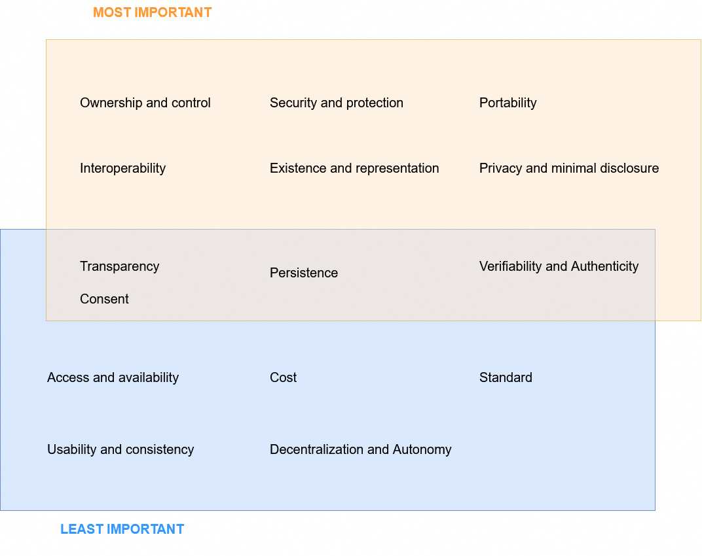
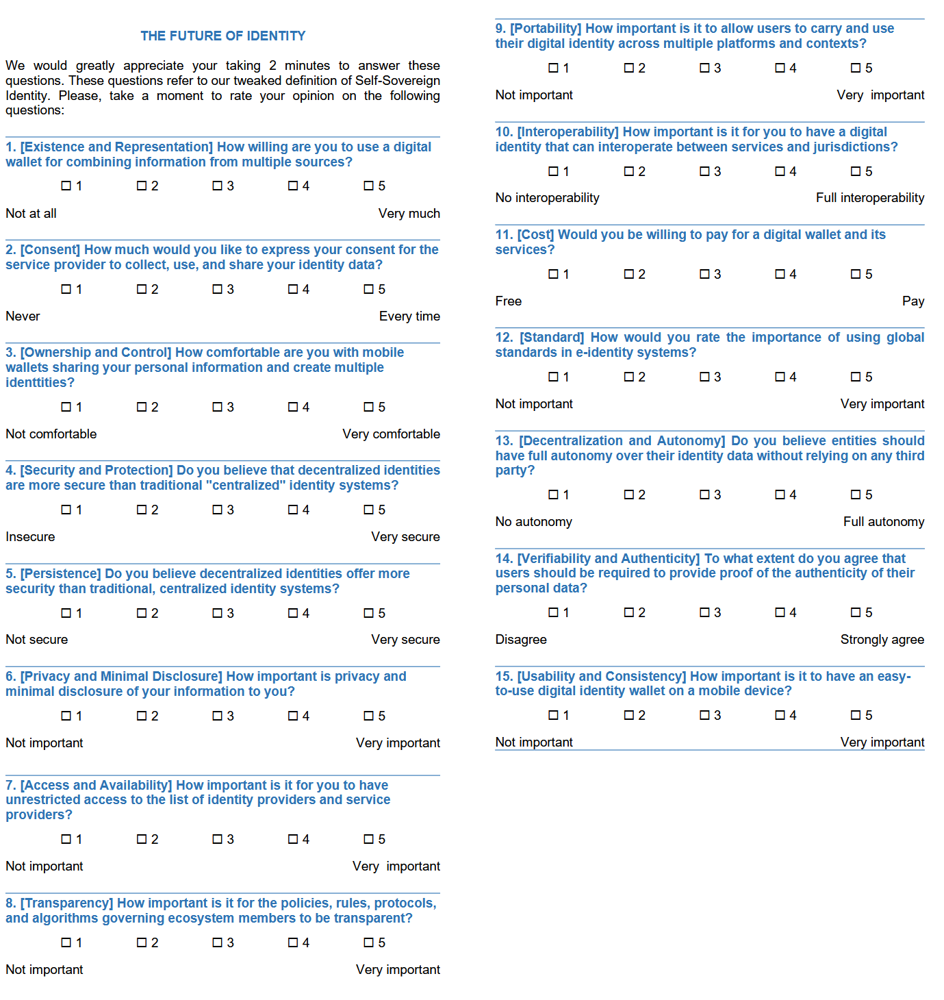

# 1. Self-Sovereign Identity 

Self-Sovereign Identity (SSI) is a novel approach that aims to provide users with an identity they can control. However, the concept also encompasses additional principles. The first to propose a list of principles extending the original Laws of Identity[^cameron] was Christopher Allen.[^allen]

Allen outlined ten guiding principles for SSI, laying the foundation for its implementation. He stated that the key properties of an SSI system are Existence, Control, Access, Transparency, Persistence, Portability, Interoperability, Consent, Minimalization, and Protection.[^allen]

## 1.1 Backgournd

Figure 1 illustrates the data flow of identity information and key roles within the general SSI model. Data moves from left to right, where issuers provide data to holders, who collect personal information within their wallet components. To access a service, users present a combination of assertions as proof of their identity to a verifier. Roles are not static, and each entity can become an issuer or verifier depending on the context. Sometimes the general model is complemented with a verifiable data registry, such as a blockchain or a registering CA, as depicted on the right-hand side of Figure 1.

The peculiarity of Figure 1 is its depiction of Allen's principles as defined in a classification of SSI properties.[^cucko] On the other hand, the communication flow on the right combines optional information through letters A, B, C, D directly from the Architecture and Reference Framework v1.4.1 of the EUDI Wallet solution.[^ARF] Occasionally, instead of a registering authority, a different type of trust anchor can be used for authentication.

*Figure 1: SSI properties mapped within the general SSI process flow.[^allen]*

## 1.2 Related works

Several works by academics and industry experts have redefined and extended Allen's original principles in an attempt to converge on a comprehensive list of principles for SSI. We collected 18 research studies published between 2016 (the year the term 'SSI' was coined) and 2024.

## 1.3 Analysis

Past tentative to converge to a list of SSI principles demonstrated significant disagreement regarding the properties of SSI. Our contribution departs from previous works[^cucko] as it incorporates a broader literature review (x5 the references of [^cucko]) and a clustering algorithm to achieve consensus on properties and their classification. Based on our literature review, this is the first time this type of exercise has been done in a paper from academia.

Specifically, our study analyzes and classifies 52 properties from 18 works to identify a subset of highly cited principles.Additionally, a questionnaire addresses three key objectives: I) Investigate the identified SSI properties and evaluate their importance. II) Identify the most and least critical properties, including non-repudiable ones. III) Validate the classification and grouping of properties.

Our study gathers insights from experts in the Decentralized and Self-Sovereign Identity Management field, spanning diverse roles and domains, including Computer Security and AI. These experts were questioned during the ARES Conference 2024, held from July 29 to August 2 in Vienna, Austria.

### 1.3.1 Methodology

A systematic review offers a structured, comprehensive overview of a research field through the following steps.[^lepore][^badzek][^cushman]

*1. Defining research questions.* We formulated research question RQ1 to explore past works on SSI principles, as introduced in the [introduction](#a-model-to-assess-digital-identity-solutions). To address RQ1 (the focus of [Section 1](#1-self-sovereign-identity)),  we generated the following search strings based on relevant keywords:

- *SSI AND principles*
- *Self-Sovereign Identity AND properties*
- *SSI AND definition*

Keywords were refined to optimize search results and to avoid wildcards (e.g., "SSI" and "Self-Sovereign Identity").[^lepore] Keywords were shuffled to gather more results.

*2. Searching.* The search strings were used to identify articles containing relevant keywords in titles and abstracts across multiple academic databases, including ACM, ArXiv, IEEE Xplore, Scopus, and the meta-search engine of Google Scholar. This process yielded 47 initial results.

*3. Screening.* Abstracts and conclusions were screened to exclude irrelevant results based on inclusion/exclusion criteria such as publication year, originality, and whether they presented a taxonomy of SSI principles. Duplicate results were removed, resulting in 18 articles for SSI. Despite being an emerging topic, the selection represents a significant portion of the literature on SSI principles from 2016 to 2024.

*4. Recording of properties.* The selected articles were analyzed to extract properties and their definitions as presented by the authors. We compiled the results into a table containing the papers and corresponding features of SSI.

*5. Comparison of properties.* Some properties shared similar meanings but had different labels across papers. Properties with identical meanings were combined, while others were eliminated using heuristics.

*6. Clustering.* The identified properties were clustered based on their labels, testing methods such as K-Means, Greedy, and Graph Theory.

*7. Refining principles.* We provide the table with the list of principles and corresponding definition. We shorten the definition as much as possible, while trying to keep their essence.

*8. Expert validation.* To validate the selection process and finalize the list of properties used in the questionnaire. These discussions reviewed and justified the inclusion or exclusion of specific properties.

*9. Final list.* The final step involved creating a definitive list of properties, accompanied by precise definitions for each.

Steps 1 and 3 are instrumental in reaching the Classification step, which may also serve to raise awareness of past works from the literature. In the following section, we detail the results from steps 4 to 8.

### 1.3.2 Recording of properties

Table 1 summarizes their key contributions: each row represents an SSI property, while the columns list the corresponding authors. Differences in naming conventions can be observed across the various authors. Notably, the 18 works describe a total of 52 properties, some of which convey similar meanings.

[Click to view the table 1.](https://cristianlepore.github.io/Self-Sovereign-Identity/definition/tables/principles/Principles1.html) *Comparison of identified properties in various sources.*

### 1.3.3 Comparison of properties.

Differences in naming can be observed between different authors. However, these properties often convey the same meaning. Consequently, the following properties were combined: (i) Existence and Representation, (ii) Ownership and Control, (iii) Access and Availability, (iv) Security and Protection, (v) Privacy and Minimal Disclosure, (vi) Decentralization and Autonomy, (vii) Verifiability and Authenticity, and (viii) Usability and Consistency. On the other hand, the properties Equity and Inclusion, as well as Recoverability, were eliminated. Thus, our rationale is based on previous works that combine these properties to create a classification of SSI principles. Figure 2 illustrates the SSI properties causal loop diagram, which shows the merging of properties across different authors.

*Figure 2: Casual loop diagram of the set of SSI properties, defined by different authors on the left. The final set of properties on the right.*

In particular, we used the same approach described in[^cucko], but we renamed Legacy System with Compliance; we merged Usability, Consistency and Accessibility with Consistency and Usability, while linking Recoverability with Usability. This allows us to have an objective analysis of properties that is based on literature.

Table 2 shows the result of combining properties. From this table we notice a significant difference between the original principles from Allen and the extended 24 principles. The 80% of authors adopt the principles from Allen; on avarage, they share 8 principles of the 10 from the original definition of SSI. Situation slightly change among the remaining 24 extending principles, shared by less than 10% of authors.

[Click to view the table 2.](https://cristianlepore.github.io/Self-Sovereign-Identity/definition/tables/principles_semplification/Principles_semplification2.html) *Comparison of identified properties grouping from various sources*

| **Category**                          | **Adoption Rate** | **Details**                                      |
|---------------------------------------|-------------------|-------------------------------------------------|
| Authors adopting Allen's principles   | 80%               | Share an average of 8 out of 10 SSI principles. |
| Extended principles (24 total)        | < 10%             | Less than 10% of authors share these principles.  |

Thus, our rationale to define a final set of principles of SSI move forward to select all principles from Table 2 that are cited by 5 or more authors. The final list contains all principles from Allen extended with 5 new principles as depicted in Figure 2, on the right.

[Click to view the table 3.](https://cristianlepore.github.io/Self-Sovereign-Identity/definition/tables/principles_semplification/Principles_semplification1.html) *Comparison of identified properties grouping from various sources and final list of properties.*

### 1.3.4 Clustering

Other than extending Allen's principles of SSI, some works provide a taxonomy of their properties, offering insights into the definition itself. In Table 4, we extend the information previously given in Table 1, detailing each principle in the first column after using the causal loop diagram in Figure 2. Similar to the principles, differences in the naming of the taxonomy can also be observed among various authors.

[Click to view the table 4.](https://cristianlepore.github.io/Self-Sovereign-Identity/definition/tables/principles_classification/Principles_classification1) *The taxonomy of principles provided by various authors.*

Thus, unlike the combination of principles, we cannot rely on past literature contributions to provide our taxonomy. Indeed, all works base their taxonomization of principles on their own interpretations. To avoid subjectivity, we decided to use a clustering technique to base our grouping on what has already been done by other authors. We tested three main methods: 

1) Greedy, which iteratively selects the local optimal solution, meaning that for a given category, it minimizes the distance between the categories. Despite its simplicity, the Greedy algorithm does not always guarantee a globally optimal solution. In cases where some principles have categories with the same number of instances, it is crucial to minimize the distance between clusters by considering multiple categories.

2) K-Means, which minimizes intra-cluster distance.

3) Finally, we used a graph representation to visually verify the results.

Results are reported within different sheets of the excel file located in: https://cristianlepore.github.io/Self-Sovereign-Identity/definition/tables/principles_classification/Summary.xlsx

The three methods lead to the same conslusion. We authomatize the process through the following [python program](https://cristianlepore.github.io/Self-Sovereign-Identity/definition/program/Compute_K-Means.py).

- The program reads data from a CSV file 
`data = pd.read_csv(file_path)`
- Fills black cells with zeroes 
`cleaned_data = numerical_columns.fillna(0)`
- Applies the K-Means clustering 
`kmeans = KMeans(n_clusters=n_clusters, init='k-means++', random_state=42)` with a pre-established value `K=5`
For reproducibility of results, we used the same seed to calculate the starting centroid through `random_state=42`
- Save results. `print(f"Clustering completed! Results saved in: {output_file}")`

We tested several combinations of parameter K (number of clusters) and eventually settled on `K=5`. This value of K ensures a fair number of elements in each cluster. Figure 3 shows the final result. The group's name is based on literature.

*Figure 3: The final set of principles and its grouping.*

### 1.3.5 Refining principles

The final set of 15 properties and their definitions can be found below. The definitions come from the combination of the 18 works from the literature. However, we shorten the definitions as much as possible, maintaining their essence for the questionnaire.

| Property | Definition |
|----------|----------|
| Existence and Representation | Entities and individuals must be able to prove their existence through the assertion of attributes to services. Additionally, individuals should be able to create as many identities as they wish.[^lepore] | 
| Consent | Entities must explicitly agree to the collection, use, and sharing of their identity data, including opt-in and opt-out options for consent. | 
| Ownership and Control | Entities can directly manage their identity, including control and negotiation of attributes from the agent/wallet to the service provider.[^cameron] | 
| Security and Protection | Entities should be protected by the use of the most cutting-edge technology. Identity should be secured and protected against suppression or invalidation of the list of attributes, IdPs, and SPs. | 
| Persistence | Individuals' identities must persist as long as the users wish, remaining valid over that period regardless of the identity provider.[^allen] Hence, individuals may present the same attributes from multiple sources.[^allen] |
| Privacy and Minimal Disclosure | The privacy of entities should be guaranteed by the use of protocols for the selective disclosure and data minimization of attributes.[^cucko] | 
| Access and Availability | Entities must have unrestricted access to the list of identity providers and service providers. | 
| Transparency | Policies, rules, protocols, and algorithms to manage the ecosystem members must be transparent. |
| Portability | Allowing users to carry and use their digital identity across multiple platforms and contexts. Attributes can be transported to other ecosystems. |
| Interoperability | Entities must be able to interoperate across domains and not be limited to a specific domain. | 
| Cost | The mechanisms for creating, maintaining, and sustaining the system should have minimal costs. | 
| Standard | An e-identity system must use globally recognized standards. | 
| Decentralization and Autonomy | Entities should have autonomy over their identity data without relying on any third party. | 
| Verifiability and Authenticity | Entities should be able to reliably verify users' identities and must provide proof of the authenticity of their personal data.[^cucko] |
| Usability and Consistency | Agents and other identity components should be easy to use, and their information should be delivered through rules, policies, and best practices that align across jurisdictions for system consistency. | 

### 1.3.6 Expert validation

To further validate our results, we conducted a survey on the proposing principles, questioning expertes in the field of decentralized identity and Self-Sovereign Identity. Experts were reached in person at the ARES conference 2024, between July 29th and August 2nd, 2024. The goal was to gain a broader understanding of the perception of the SSI concept (part 1) and its associated properties (part 2). The goal of the survey was to investigate if our identified properties, their naming, and definition, were consistent with the opinion of the respondents. Moreover, the goal was to determine the perceived level of importance of the identified properties, determining the most and least important property. Furthermore, while obtaining experts' opinions, the goal was to identify additional concerns, inconsistencies, misunderstandings, and properties that might have been overlooked.

**Methodology**

The ARES conference was held in Vienna between July 29th and August 2nd, 2024. It held the International Workshop on Emerging Digital Identities[^ares]. Partecipants in the room were aked to answer a list of 37 questions divided in two parts; the first 20 questions were relevant to get insights in the field of decentralized identity, and were general. The second part aimed to frame our properties defined in [Section 1.3.5](#135-refining-principles). The questionnaire was given on a voluntary basis to the candidates in the room, while a digital version of the same list of quesitons was available through a QR code for those who preferred to answer electronically. The online version was made available to them from a QR code and designed using Microsoft Forms[^microsoft], during the entire lenght of the conference between 29 July 2024 and 2 August 2024.

**Questionnaire structure**

The questionnaire accounts for a total of 37 questions that follow the fifteen principles defined in [Section 1.3.5](#135-refining-principles) along the line. The first part of the questionnaire was instrumental to get familiar with the candidates knowledge of identity. In the second part, questions were instrumental to test the validity of the SSI properties and questions followed the order of our 15 proposed principles. Besides other contributions of the same type attached the list of principles for evaluation, requireing respondents to spend a significant amount of time goind through all the defintiions, we believe that the time spent for the completition of the questionnaire was an active part of the syrvey, and influenced the total percentage of respondents. Hence, we decided to decreese the time to engage of respondents as much as possible by shortening the time to completition in order to increase the number of respondents and decreae the dropout rate. For this reason, we decided to create a question for each principle, and embed the definition of the principles directly within the question, while keeping awarness in the respondents. The [Appendix A](#appendix-a) contains a sample of the questionnaire related with the questions about principles of Self.

Each question aims to measure the perceived level of importance of each property with a Likert scale consisting of the following Likert items (i) Irrelevant, (ii) Slightly relevant (Unnecessary), (iii) Moderately relevant (Useful), (iv) Relevant (Desirable), (v) Very relevant (Mandatory).[^joshi] In this question, we were trying to determine if our definition in [Section 1.3.5](#135-refining-principles) were appropriate or not. Thus, the respondents had the opportunity to agree with the proposed definition. 

**Partecipants**

We broadcasted the survey among participants of the International Workshop on Emerging Digital Identities at the ARES conference 2024.[^ares] The track lasted for the entire morning and we collected result at the end of the session. Therefore, the questionnaire was sent to experts in the field of Decentralized and Self-Sovereign Identity Management in anonypus fashion, and aprticipants were from the academia and the industry.

Twenty-seven responded to the survey and completed it in full. While all preferred to stay anonymous, we have collected their responses and analysised results. For those who completed the survey online, the avarage time for completintion was of 11.48 minutes; the fastest completed the survey in 10.27 minutes and the slowest in 15.02 minutes. 15 participants held an identity wallet in their mobile device; more than 50% of respondents. Besides we did not track any of their job positions, roles, and affiliation, we know they were interested in identity and half of them have an identity wallet on their mobile device, even tough 56% of them do not present certificates through a digital wallet. 48% of respondent believe that governments should pay for the design of the wallet, and 59% agree that government should pay for the deployement of the ecosystem of services and infrastructure that surround the identity wallet. 37% agree that identity wallet are a more secure means to authenticate with services, while authentication happens generally through biometrics (fingerprintings and facial recognition). Finally, the majority of respondents would be willing to pay for a wallet rather than receiving advertisements. The full list of this first set of questions and answers is available in the [Appendix B](#appendix-b).

**Limitations**

The study was limited to 15 properties that were included in the questionnaire and presented in Section III-A. It was also limited to the classifications presented in [Section 1.3.5](#135-refining-principles). The number of respondents that took part in the questionnaire (27) presents another limitation. Therefore, a larger number of respondents would mean a greater validity of the results and a greater possibility of generalization. Nevertheless, as the field of SSI is a young research field, we were striving to receive truly experts in it, thus not forcing the increase of respondents by broadening the experts’ scope, although further discussion and research will be needed to be able to offer bulletproof/solid definitions.

**Results and discusison**

[Click to view the table 5.](https://cristianlepore.github.io/Self-Sovereign-Identity/definition/survey/part2/Survey.html) *Comparison of identified properties in various sources.*

### 1.3.7 Final list

## Appendix A

A copy of the survey given to respondents at the International Workshop on Emerging Digital Identities at ARES 2024.[^ares]

## Appendix B

Results of the first part of the Survey.

## References

[^lepore]: Lepore, Cristian, et al. "A Model For Assessing The Adherence of E-Identity Solutions To Self-Sovereign Identity." World Conference on Information Systems and Technologies. Cham: Springer Nature Switzerland, 2024.

[^cameron]: Cameron, Kim. "The laws of identity." Microsoft Corp 12 (2005): 8-11.

[^allen]: Allen, Christopher. "The path to self-sovereign identity." Life with Alacrity (2016).

[^cucko]: Čučko, Špela, et al. "Towards the classification of self-sovereign identity properties." IEEE access 10 (2022): 88306-88329.

[^ARF]: EUDI Wallet. Architecture and Rererence Framework v 1.4.1 https://eu-digital-identity-wallet.github.io/eudi-doc-architecture-and-reference-framework/1.4.0/ Accessed on December 28, 2024.

[^badzek]: Badzek, Laurie, et al. "Ethical, legal, and social issues in the translation of genomics into health care." Journal of Nursing Scholarship 45.1 (2013): 15-24.

[^cushman]: Cushman, Reid, et al. "Ethical, legal and social issues for personal health records and applications." Journal of biomedical informatics 43.5 (2010): S51-S55.

[^toth]: Toth, Kalman C., and Alan Anderson-Priddy. "Self-sovereign digital identity: A paradigm shift for identity." IEEE Security & Privacy 17.3 (2019): 17-27. 

[^toip]: Trust Over IP Foundation. Principles of self-sovereign identity (ssi). https://trustoverip.org/wp-content/uploads/2021/10/ ToIP-Principles-of-SSI.pdf, 2024. Accessed: 2024-12-24 

[^ferdous]: Ferdous, Md Sadek, Farida Chowdhury, and Madini O. Alassafi. "In search of self-sovereign identity leveraging blockchain technology." IEEE access 7 (2019): 103059-103079.

[^pava]: Pava-Díaz, Roberto A., Jesús Gil-Ruiz, and Danilo A. López-Sarmiento. "Self-sovereign identity on the blockchain: contextual analysis and quantification of SSI principles implementation." Frontiers in Blockchain 7 (2024): 1443362.

[^bokkem]: Van Bokkem, Dirk, et al. "Self-sovereign identity solutions: The necessity of blockchain technology." arXiv preprint arXiv:1904.12816 (2019).

[^omar]: Dib, Omar, and Baha Rababah. "Decentralized identity systems: Architecture, challenges, solutions and future directions." Annals of Emerging Technologies in Computing (AETiC) 4.5 (2020): 19-40.

[^joshi]: Joshi, Ankur, et al. "Likert scale: Explored and explained." British journal of applied science & technology 7.4 (2015): 396-403.

[^microsoft]: Microsoft Forms. https://en.wikipedia.org/wiki/Microsoft_Forms, accessed on January 2nd, 2024.

[^ares]: https://www.ares-conference.eu/edid, accessed on 2nd January, 2024.
