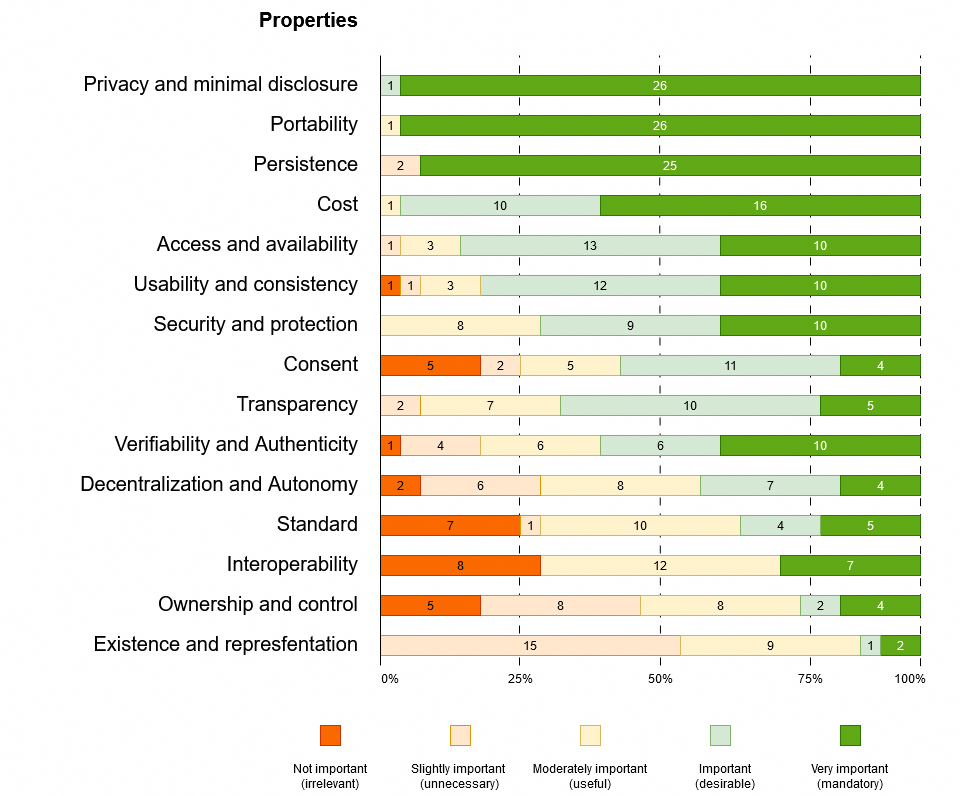
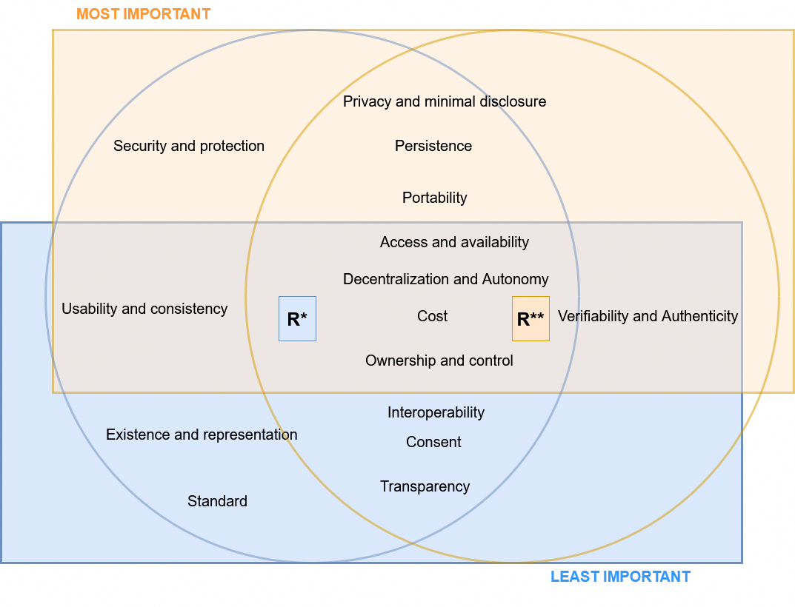
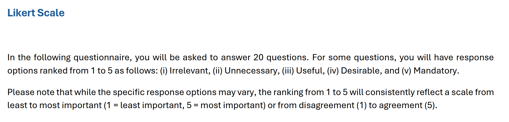
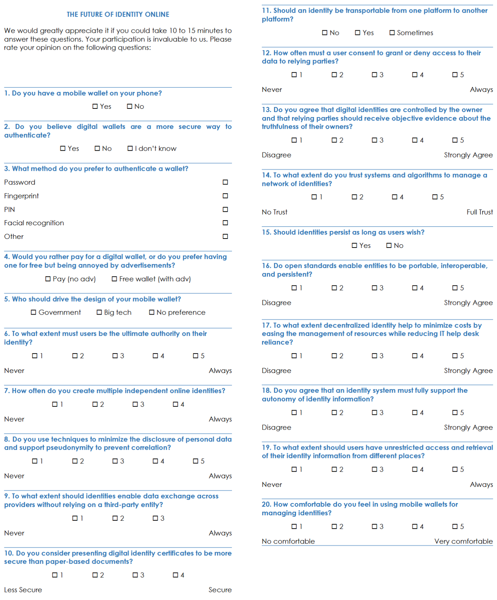

# 1. Self-Sovereign Identity

Self-Sovereign Identity (SSI) is an innovative approach to identity management that empowers users with full control over their identities. With SSI, users can devide what information to share with whom. However, describing SSI as control of information is just a part of its essense; the rest incorporates several core principles. The first to frame a list of principles for SSI was Allen[^allen]; since its list, numerous academics and working groups have further refined and expanded upon them to create a more comprehensive list of properties. As of today, there is no agreed-upon list of what those properties are, nor their definition. This chapter shed light on the debate surrounding SSI and we aim to converge to a comprehensive list of principles. We provide rationale for those principles combining a quantitative and a qualitative analysis.

## 1.1 Background

In 2016 Allen defined the properties of SSI which include *Existence, Control, Access, Transparency, Persistence, Portability, Interoperability, Consent, Minimalization, and Protection.*[^allen] These properties reflects back to the way individuals mange their digital identity and share personal credentials.

The philosophy of SSI shares many similarities with the concepts of decentralized identity and borrows many of its technical elements. A couple of years later, the W3C[^w3c] proposed an archetype based on three key roles and a data flow consistent with the idea of SSI, which was promptly shared by other community projects like Sovrin.[^sovrin] The three entities were: issuer, holder, and verifier. Issuers provide data for holders, who collect claims and later present them as assertions to service providers. Assertions may consist of claims combined in various ways and formats. The roles within the data flow are not fixed; each entity can act as an issuer or a verifier depending on the context. For example, the holder may occasionally issue claims to the verifier, while the verifier can also issue claims to holders upon request. In some cases, a verifiable data registry, such as a blockchain registry or a certificate authority (CA), can be integrated into the model, as shown in Figure 1.

However, there is an intertwine between the concept of SSI and the underneath technology. While the principles of SSI have shaped the architecture proposed by the W3C, some studies have sought to position the principles of SSI within the proposed architecture.[^cucko] Positioning principles within the SSI data flow allows to put properties in prespective of a pragmatic application of properties, while opening to subsequent works, for example developing an assessment model based on SSI. To shed light on the positioning of properties, we have investigated information from [^cucko], the Trust Over IP Foundation [^toip], the W3C,[^w3c] and the Architecture and Reference Framework v1.4.1 of the EUDI Wallet solution,[^ARF] with the hope of building the most comprehensive image of the Allen properties within the SSI architecture. The position of properties is consistent with the information from [^cucko]. Although we did not infer anything else, the position of these principles refers only to Allen’s principles and does not fit other definitions of SSI from other authors. Furthermore, the use of a registering CA - or another form of centrally managed or decentralized repository - can be replaced with a different type of trust anchor to validate certificates.

As other authors have proposed a different set of principles and definitions, we aim to analyze their contributions and converge to an agree upon set of properties.

*Figure 1: Systematic positioning of Allen's properties within the SSI process workflow.[^allen]*

## 1.2 Related works

Several contributions experimented with Allen's principles in an attempt to find a set of properties for SSI. Some of these contributions show significant disagreement on the set of principles, their definition, and categorization across authors and community groups. The following is a summary of eighteen contributions considered in this work. We believe this analysis is instrumental in building further analyses on SSI-based solutions.

In 2016, a work from the Sovrin Foundation[^tobin] was among the first to redefine Allen's principles while keeping their original names. Over the years, the Sovrin Foundation continued to foster its contribution to SSI principles, providing two further versions of its principles. Their latest version extends Allen's principles with eleven new properties while sharing only five of the original properties from Allen.[^sovrin] Inspired by this work, the Trust Over IP Foundation built on top of it.[^toip] Other contributions from academia replicated the same exercise of Sovrin, providing principles with the same names as Allen but different definitions,[^muhle][^pava] and shrinking the principles to a core set of core aspects.[^sheldrake] A business-oriented analysis outlined Personal Data and Usability.[^BlockTechDiVer] Other contributions include technical considerations,[^ferdous][gilani2020survey] and social analyses.[^andrieu] Satybaldy's extensions focus on trust, privacy, and usability,[^satybaldy] while the European project eSSIF-Lab defined six core principles to drive the adoption of SSI technology in Europe.[^essif] Finally, a review of Identity and Access Management requirements led to 15 new principles based on efficiency and effectiveness.[^glockler]

Eleven of the eighteen works considered in our contribution complement the list of principles through a categorization of the properties. For example, the first document from the Sovrin Foundation gathered principles into a three-way taxonomy of Control, Portability, and Security [^tobin], to eventually rename their categories in their latest draft document [^sovrin]. Controllability, Security, and Portability are instead the categories used in [^pava]. Andrieu categorized principles into Control, Acceptance, and Costs [^andrieu]. Security, Operability, Technology, and User are the four categories described in [^glockler]. The seventeen principles from [^ferdous] were grouped into Foundational, Sustainability, Security, and Flexibility, and a similar categorization was done by [^gilani2020survey]. These diverse categorizations are the result of different definitions of principles and different focus of the content analysis. Besides outlining differences in the naming of principles and categories, this summary highlights the effort of diverse subjects to converge on a core idea for SSI.

## 1.3 Methodology

A coarse-grained overview of the research topic provides a comprehensive perspective of works on the SSI principles. An initial selection of 18 works from the literature review outlined 52 properties, which were then filtered throgh heuristics. In addition to the list of properties, our work introduces a unique categorization through clustering techniques. Finally, we proposed a questionnaire for experts to: I) Investigate the identified SSI properties and assess their importance. II) Identify the most and least critical properties, including non-repudiable ones. III) Validate the grouping of properties. IV) Refine the principles.

To gather relevant articles, we conducted a systematic review, which provides a structured overview of a research field by adapting the steps presented in [^lepore][^badzek][^cushman].

*1. Defining search strings.* We formulated the research question *RQ1: What are the principles of Self-Sovereign Identity?* From RQ1, we extracted keywords and create the following search string:

- *"Self-Sovereign Identity" AND "principles"*

Keywords were refined and shuffled to avoid wildcards; for instance, Self-Sovereign Identity was replaced with SSI.[^lepore]

*2. Searching.* Search strings were used to retrieve papers from databases, including ACM, ArXiv, IEEE Xplore, Scopus, and the meta-search engine Google Scholar. This process yielded 47 results.

*3. Screening.* Abstractss were reviewed to exclude results not concerning with our research question RQ1. Duplicate entries were removed. The final selection consists of 18 papers published from 2016 to 2024.

*4. Recording of properties.* We extracted 52 property labels from the literature and organized them into a table to provide a comprehensive overview.

*5. Merge.* Some properties had similar meanings but were labeled differently by different authors. The merging process allows for merging labels that represent identical properties. The output is a list of 34 properties.

*6. Selection.* We have extracted the most relevant properties using a heuristic.

*7. Clustering.* Clustering allows us to answer the quesiton: *can we cluster principles based on their labels to create categories?*. We used results to further analyze the state of play.

*8. Definition of principles.* We summarized the definitions of properties from authors while retaining their essence.

*9. Expert validation.* We proposed a questionnaire to investigate the identified SSI properties and assess their importance. The outcome served also to refine their definitions.

*10. Final list.* We framed the final list of properties, accompanied by precise definitions for each.

*Figure 1. The process of our literature review. Squares putlines the main process. Rounded squares are outputs. In the process, the output feeds the next step.*

The next part details steps 4 to 10.

### 1.3.1 Recording of properties

Table 1 summarizes the names of the properties and contributions identified through the search and screening process. The rows represent principles of SSI, while the columns correspond to contributions. Our literature review examined a total of 18 relevant works in the field of identity, covering 52 properties. The checkmarks indicate the properties addressed by the respective author(s). Notably, some works propose alternative sets of principles, and variations in naming conventions can be observed across different authors.

[Click to view the table 1.](https://cristianlepore.github.io/Self-Sovereign-Identity/definition/tables/principles/Principles1.html) *Comparison of identified properties in various sources.*
[Table 1 alternative version.](https://cristianlepore.github.io/Self-Sovereign-Identity/definition/tables/principles/Principles2.html) *Alternative view of Table 1. It conveys the same information.*

### 1.3.2 Merging

Difference in the naming of properties across various authors can be observed. However, many of these properties convey the same or similar meanings. To avoid pitfalls, we have consolidated property labels based on previous works by [^cucko][^sovrin][^toth][^stokkink][^ferdous][^andrieu]. This resulted in the following merges: (i) Existence and Representation, (ii) Ownership and Control, (iii) Ownership and Choosability, (iv) Access and Availability, (v) Portability and Secure Identity Transfer, (vi) Interoperability and Compliance, (vii) Consent and Participation, (viii) Protection and Secure Transactions, (ix) Protection and Security, (x) Protection and Counterfeit Prevention, (xi) Minimization and Privacy, (xii) Minimization and Disclosure Minimization, (xiii) Usability and Consistency, (xiv) Consistency and Recoverability, (xv) Decentralization and Autonomy, (xvi) Provability and Identity Assurance, (xvii) Provability, Verifiability, and Authentication, and (xviii) Identity Assurance and Identity Verification.

This approach aligns our list with established terminology in the field of identity, and ensures a coherent naming across works. Additionally, we slightly adjusted the work of [^cucko] to reflect updates in a more recent literature review. Specifically, we removed the properties of Equity and Inclusion, as well as Recoverability. Furthermore, we renamed Legacy System with Compliance; we eliminated the links between Control and Agency, Access and Usability, and Availability and Recoverability. Figure 2 visualizes the results through a Causal Loop Diagram based on these papers. The diagram includes only the properties subject to modification or merging.

*Figure 2: Casual loop diagram of the set of properties, defined by different authors.*

The merging process has collapsed some of the principles naming together and shrinked the list by 34%, leading to a total of 34 principles. The new list, presented in [Table 2](https://cristianlepore.github.io/Self-Sovereign-Identity/definition/tables/principles_semplification/Principles_semplification2.html), shows that Allen's principles are, on average, shared by 13 out of 17 authors, while the remaining 24 principles are shared by fewer than 2 authors on average.

[Click to view the table 2.](https://cristianlepore.github.io/Self-Sovereign-Identity/definition/tables/principles_semplification/Principles_semplification2.html) *Comparison of identified properties grouping from various sources.*

| **Category**                          | **Frequency** | **Authors** |
|---------------------------------------|-------------------|-------------------|
| Allen's principles   | ≈ 80% of authors | ≈ 13 autors |
| Extending 24 principles  | < 10% of authors | < 2 authors |

### 1.3.3 Selection

Figure 3 puts into perspective the list of principles (horizontal axis) with their occurrence by authors (vertical axis). It represents the number of papers citing each principle. The first ten principles are cited by at least twelve authors, while the extended principles are referenced by significantly fewer authors on average. A possible interpretation is that Allen’s principles have been established for a longer time. Additionally, the chart reveals that 19 out of the 24 extending principles, were cited by fewer than five authors. Notably, most of these 19 principles were, on average, shared only two authors.

*Figure 3: The graph indicates how many authors have adopted the principles.*

We used this finding to extract a subset of principles for SSI, and applying a heuristic based on the number of citations; namely, we selected principles cited by at least the 25% of the authors. This heuristic of 25% is a typified strategy that aids in making decisions efficiently by relying on practical rules.[^heuristic] Thus, the final list includes principles that surpass the red threshold in Figure 3. The final list is reported in [Table 3](https://cristianlepore.github.io/Self-Sovereign-Identity/definition/tables/principles_semplification/Principles_semplification1.html), and accounts for 15 principles - 10 from Allen plus five. Note that the merging process has collapsed some of their names within the same cell.

Figure 4 shows the distribution of principles across authors, where each point represents an instance of a principle used by an author. The x-axis represents the final set of principles, while the y-axis displays the contributions from the authors.

*Figure 4: Principle distribution bubble chart.*

[Click to view the table 3.](https://cristianlepore.github.io/Self-Sovereign-Identity/definition/tables/principles_semplification/Principles_semplification1.html) *Our final list of properties and their namings.*

### 1.3.4 Clustering

A category is useful to "*illuminate a relationship between the subjects and objects of knowledge.*"[^mahalakshmi] For this reason, we aimed to provide a categorization of properties that illuminates the relationship between properties and Self-Sovereign Identity. However, we aim to cluster principles using the existing labeling from the literature, and we do not focus on the defintion of classes. Some of the above-mentioned works have already clustered principles, as discussed in [Related Works](#12-related-works), but we aim to combine past exercises from various authors.

Instrumental to this exercise is [Table 4](https://cristianlepore.github.io/Self-Sovereign-Identity/definition/tables/principles_classification/Principles_classification1), which gathers information about past categorizations from authors. Each cell of the table corresponds to the name of a category, while principles are listed in the first column.

[Click to view the table 4 with 15 properties only.](https://cristianlepore.github.io/Self-Sovereign-Identity/definition/tables/principles_classification/Principles_classification1) *The categorization of principles provided by various authors about the 15 skimmed principles.*
[Table 4 with the complete list of 34 properties.](https://cristianlepore.github.io/Self-Sovereign-Identity/definition/tables/principles_classification/Principles_classification2) *The categorization of principles provided by various authors concerning the total of 34 principles.*

Table 4 breaks down classes by author and shows how heterogeneous the categorization of principles from various authors is. Indeed, no two works have the exact same list of classes (or categories). However, their content analysis is not straightforward. To clarify the conveyed information, we analyze five information from the list of fifteen principles. We aim to address, for each class:
1. How many principles overall pertain to that class?
2. How many contributions cite that class?
3. How many unique principles for each author?
4. How many unique authors?

Questions 1 and 2 are addressed by Figure 4. Questions 3 and 4 are addressed in Figure 5.

INSERIRE APPENDICE CON I PROGRAMMI USATI ED IL CODICE;
PER OGNI CLASSE, QUALI ARTICOLI LO CITA

*Figure 5: *

*Figure 6: *

We applied clustering techniques to group principles our clustering process. The resulting table is presented in the first sheet of the [Excel file](https://cristianlepore.github.io/Self-Sovereign-Identity/definition/tables/principles_classification/Summary.xlsx). In this table, rows represent the 15 properties, columns correspond to the categorization of principles from [Table 4](https://cristianlepore.github.io/Self-Sovereign-Identity/definition/tables/principles_classification/Principles_classification1), and cell numbers indicate occurrences by author. We employed three clustering techniques: Greedy, K-Means, and Graph Theory.

*Figure 6: *

*Figure 5: *

*Figure 6: *

*Figure 7: *

To better illustrate the relationship between properties and key aspects of SSI, we created five groups of principles based on past definitions.

**Clustering techniques**

1) Greedy models iteratively select the locally optimal solution, minimizing the distance between clusters. The process begins by selecting the column from the [excel file](https://cristianlepore.github.io/Self-Sovereign-Identity/definition/tables/principles_classification/Summary.xlsx) (second sheet) with the highest number of occurrences and grouping rows that minimize the distance from that column. The Greedy approach has the advantage that is easy to use and simple. Despite its simplicity, it does not always guarantee a globally optimal solution because part of the result depend from the starting point. If not properly chosed, the local optimal does not coincide with the global optimal. Therefor, when multiple categories have the same number of instances, it is essential to minimize the distance between clusters by considering multiple categories.

2) K-Means aims to minimize intra-cluster distances. Graphically, it initializes a centroid at a random point on the chart and iteratively adjusts to find the nearest points. The number of centroids, K, significantly affects the result. We automate the process through the following steps: [Python Program](https://cristianlepore.github.io/Self-Sovereign-Identity/definition/program/Compute_K-Means.py) whose main steps are as follows:

- The program reads data from a CSV file 
`data = pd.read_csv(file_path)`
- Fills black cells with zeroes 
`cleaned_data = numerical_columns.fillna(0)`
- Applies the K-Means clustering 
`kmeans = KMeans(n_clusters=n_clusters, init='k-means++', random_state=42)` with a pre-established value `K=5`
For reproducibility of results, we used the same seed to calculate the starting centroid through `random_state=42`
We tested several combinations of parameter K (number of clusters) and eventually settled on `K=5`. This value of K ensures a fair number of elements in each cluster.
- Write output and save results. `print(f"Clustering completed! Results saved in: {output_file}")`

3) Graph theory represents points as vertices connected by edges. The edges are weighted based on the number of instances of articles from authors. For example, if three articles use the category 'Controllability,' the corresponding edge will have a weight of three. While this method is visually appealing and easy to understand, it does not scale well to hundreds of nodes.

Figure 3 shows the final result of our grouping process. The group's name is derived from the literature.

*Figure 4: The final grouping.*

### 1.3.4 Definition of principles

We have combined the definitions of principles from 18 works, condensing them for quick comprehension while preserving their essence. This merging was done by referring to the authors' definitions as summarized in [Table 2](https://cristianlepore.github.io/Self-Sovereign-Identity/definition/tables/principles_semplification/Principles_semplification2.html). By combining definitions from at least two authors, we aimed to give a concise defintion. In some cases, we encountered similar definitions from more than two authors. To ensure consistency during the merging phase, we used uniform wording and synonyms. For example, we standardized the terms "users", "individuals", and roles like "holder" by referring to them as "entities."

| Property | Definition |
|----------|----------|
| Ownership and Control | Entities must have full control and ultimate ownership of their Self-Sovereign Identity. This includes secure algorithms that maintain the validity of the identity and its claims, whether self-asserted or issued by a third party.[^allen][^ferdous] | 
| Existence and Representation | Entities must be able to verify their existence by presenting attributes to service providers and generating multiple identities as needed.[^allen][^sheldrake] |
| Privacy and Minimal Disclosure | The SSI solution should not include any method for associating biometric data with an underlying identity. Personal and confidential identity-related data should only be shared with the owner’s consent, and only the minimum necessary information should be shared with third parties.[^naik][^toth] | 
| Interoperability | Identities  should  be  as  widely  usable as possible.[^stokkink] The systems shall enable digital identity data for an entity to be represented, exchanged, secured, protected, and verified interoperably.[^toip][^allen] | 
| Security and Protection | The security of an identity and its related communication is paramount for any SSI solution. The system must prioritizing censorship-resistant methods that promote individual rights and freedom through cryptographically secure connections and communications.[^naik][^pava] |
| Portability | Identities must be portable. Entities should be able to securely transfer or move their identity data to agents or systems of their choice.[^cucko][^glockler] |
| Consent | Entities must provide explicit consent for the collection, use, and sharing of their identity data, with the option to opt in or opt out at a later time.[^cucko][^allen] |
| Verifiability and Authenticity | Entities should be able to reliably prove their identity.[^cucko] Any identity should be verifiable through its credentials on the Web, in a manner similar to how a physical credential represents a real-world identity.[^naik] |
| Transparency | Systems and algorithms must be transparent.[^stokkink] The systems used to manage and operate a network of identities should be open, both in terms of their functionality and in how they are managed and updated.[^allen] |
| Persistence | Identities must be long-lived. A self-sovereign identity must ensuring that identities endure for as long as needed by the owner.[^pava][^allen] |
| Standard | A self-sovereign identity must be based on open standards to ensure maximum portability,[^cucko] interoperability and adoption as well as sustainability.[^ferdous] | 
| Cost | An identity should be provided to general users free of charge, with no hidden costs, licensing fees, or other financial charges.[^naik] Any proposed standard for self-sovereign identity must be adoptable at an extremely low cost.[^andrieu] | 
| Decentralization and Autonomy | A Self-Sovereign Identity must enable complete autonomy in managing and administering identity information, without relying on a centralized system to represent, control, or verify an entity's digital identity data.[^sovrin][^essif][^ferdous] | 
| Access and Availability | Identity must always be available to entities, which in turn must have unrestricted access to their identity information. Entities should be able to retrieve all information, including claims and assertions.[^ferdous][^tobin] | 
| Usability and Consistency | Entities should be able to count on a consistent experience across various technology platforms and services, with the system prioritizing the usability and accessibility of agents and other SSI components.[^satybaldy][^sovrin] |

### 1.3.5 Expert validation

To validate the proposed principles, we conducted a survey targeting experts attending the digital identity keynote at the ARES Conference 2024, held from July 29 to August 2 in Vienna, Austria. In parallel to a survey, we considered other methods of gathering input from participants, for example interviews. Despite the need for careful design to achieve a good response rate,[^ward] we preferred surveys over interviews because they allow participants to share their opinions without bias or fear of judgment, making them more likely to select their preferred options freely.[^mol] Additionally, since ARES is an international conference, conducting interviews in English could introduce biases due to language barriers, wording issues, and potential misunderstandings. Time was another critical factor we considered. Indeed, conference attendees may not have been willing to dedicate significant time to interviews. In contrast, a survey could reach a broader audience and allow participants to complete the questionnaire at their convenience. Due to these factors, we ultimately opted for a survey.

Participants were approached in person and asked to complete an online questionnaire.

The purpose of a survey was to gain a broader understanding of the perception of the SSI concept and its associated properties. Specifically, we invited respondents to complete an online questionnaire to: I) Investigate the identified SSI properties and their importance. II) Identify the most and least critical properties, including non-repudiable ones. III) Validate the classification and grouping of properties. The survey aimed to assess the perceived importance of these properties, highlighting the most and least critical ones. Additionally, by gathering expert insights, we sought to uncover any overlooked concerns, inconsistencies, misunderstandings, or missing properties in our analysis.

**Methodology**
The ARES Conference hosted the *International Workshop on Emerging Digital Identities**.[^ares] At the entrance to the hall, just before the keynote on identity and Self-Sovereign Identity started, a QR code was distributed to participants. By following the link, on a voluntary basis, participants were invited to electronically answer a list of 20 questions designed to evaluate the properties of SSI and gather insights into their definition. At the end of the survey, a final question asked respondents to provide their name or remain anonymous. The online questionnaire, created using Microsoft Forms,[^microsoft] was available throughout the entire conference, from July 29 to August 2, 2024. At the end of the available period, we collected the results and analyzed the responses.

**Questionnaire structure**
The questionnaire consisted of two parts. The first five questions aimed to familiarize participants with the candidates' knowledge of identity, while the remaining fifteen questions were designed to validate the SSI properties. While a similar contribution from [^cucko] in the field of SSI required respondents to go through a review process of SSI principles definitions, this led to 38.6% of respondents dropping out of the questionnaire before finishing. We aimed to minimize dropouts as much as possible. According to [^ward], survey response rates depend on the topic, the number of questions, and the time required for completion. We identified a tradeoff between the number of questions and the duration of candidate engagement. Fourteen percent of dropouts occur with a 10-minute engagement, while this percentage rises to 20% at 15 minutes, and it continues to increase as the number of questions grows.[^ward] Therefore, we aimed to keep our survey completion time between 10 and 15 minutes. To achieve this, we embedded brief definitions of key principles directly within the questions, ensuring respondents remained aware of them throughout the process. At the same time, we carefully summarized the definitions to maintain clarity and accessibility for a broad audience in the field of identity. We estimated an average of 40 seconds per question through local testing. However, this is only a cruel estimate.

Each question is designed by extracting keywords from the definition of principles and using them as the main drivers for formulating the question. Then, each question measured the respondents' perceived level of importance using a Likert scale.[^south] The Likert scale consists of one or more statements or questions accompanied by a range of response options. The scale values typically range from (i) Strongly Disagree, (ii) Disagree, (iii) Neutral, (iv) Agree, and (v) Strongly Agree, or they may also be interpreted as (i) Irrelevant, (ii) Slightly Relevant (Unnecessary), (iii) Moderately Relevant (Useful), (iv) Relevant (Desirable), and (v) Very Relevant (Mandatory).[^joshi] In our case, we maintained the same five-point scale but adapted it to fit the questions while preserving the intended meaning for respondents. In this regard, Figure 4 presents a template of a Likert scale questionnaire with three questions, each offering different response options.

*Figure 4: A Likert scale consists of a series of Likert items, each accompanied by numbered response options and text anchors.*

Various aspects of Likert item construction can influence how participants interpret and respond to a questionnaire, including the number of response options, the text anchors assigned to each option, and the numerical values associated with each response. There is no universally ideal approach for all situations; rather, the appropriate design of a Likert item depends on the specific context of the study. Key considerations in constructing the scale include: (i) Number of choices – The response options available to participants. (ii) Text anchors – The written descriptors accompanying each numeric response option. (iii) Question phrasing – The wording of the statements to which participants respond. (iv) Numerical representation – The characteristics of the numbers used to differentiate response options.

Reporting the design of the Likert scale is crucial for enabling future replication studies. Without detailed descriptions of Likert scale implementations, it would be impossible to determine whether contradictory results from a replication study genuinely refute the effect found in the original study or if participants simply responded differently to the questions. For this reason, within the questionnaire was attached a document explaining how to handle the Likert scale along with the questionnaire. Both can be found in [Appendix A](#appendix-a) of this report. The questions represent the factual questionnaire presented at the conference.

Questions can be divided into two groups. On the one hand, the first five questions are intended to gather insights on wallet usage and business models. On the other hand, the remaining 15 questions are designed to evaluate principles. In this case, we used a different Likert scale with five or fewer points.

**Pitfalls**
As mentioned, one of our objectives was to balance the number of questions with the time required to complete each one, aiming to maintain a high response rate. However, we did not measure the dropout rate in our analysis. Due to our deliberate choice to keep the survey short, we did not track participants' job positions, roles, or affiliations. Furthermore, the number of respondents (27) constitutes a relatively small sample. A larger sample would certainly strengthen the study.cIn the future, further efforts should be made to complement this work with comprehensive data collection, including tracking the dropout rate.

**Partecipants composition**
A total of 27 respondents completed the survey in full but chose to remain anonymous. We report insights from three types of questions regarding survey completion time, wallet usage, and business models for wallet and service deployment.

Survey completion time: on average, respondents took 11.48 minutes to answer all questions. The quickest respondent took slightly less than 10.30 minutes, while the longest completion time was about 15 minutes. The timing is considered only when the webpage is open. This means that if a person leaves the survey and returns a few hours later, only the time of active engagement on the platform is counted. Figure 5 shows the completion time and the frequency of participants who completed the survey within that time. The vertical axis represents the occurrence of participants, while the horizontal axis represents the length of time required to complete the survey.

Regarding wallet usage, more than 50% of respondents hold an identity wallet, and 37% believe wallets are more secure than traditional authentication mechanisms. Among wallet users, fewer than 45% use wallets to present online certificates.

As for business models of wallets and service deployment, 48% of respondents would like to see direct government involvement in the deployment of identity wallets, while 59% would like governments to contribute to developing the necessary infrastructure. The majority of respondents expressed a preference for paying for an identity wallet rather than receiving advertisements.

*Figure 5: shows the completion time and the frequency of participants who completed the survey within that time.*

**Results and discussion**
The breakdown of responses to the 20 questions in the questionnaire is available in [Appendix B](#appendix-b).

[Table 5](https://cristianlepore.github.io/Self-Sovereign-Identity/definition/survey/Survey.html) shows the results of respondend related to the 15 proposed properties and their ranking based on the avarage and the standard deviation.

[Click to view the table 5.](https://cristianlepore.github.io/Self-Sovereign-Identity/definition/survey/Survey.html) *Ranking of identified properties.*

The figure below shows a breakdown of the votes for each property.

*Figure 6. Perceived level of importance for properties.*

The most and least important properties, as well as their intersection, is presented below.

*Figure 7. The most and least important properties of both rankings.*

As last think, we have leveraged the findings from our survey to analyze the importance of clusters. For this objective, we have assigned a weight to the properties in the most important and least important frames. A weight of three to the most important properties, and one to the least important properties. As a consequence, a weight of two is assigned to properties at the intersection of the two frames.

Hence, we go through the five clusters, sum up results for each property and normalize to obtain a comparable result.

Controllability:  
| Property | Weight |
|-----------|-----------|
| Consent | 1 |
| Existence and representation | 1 |
| Ownership and control | 2 |
| AVG | 1.3 |

Security
| Property | Weight |
|-----------|-----------|
| Persistence | 3 |
| Privacy and minimal disclosure | 3 |
| Security and protection | 3 |
| AVG | 3 |

Usability and Agency
| Property | Weight |
|-----------|-----------|
| Decentralization and Autonomy | 2 |
| Usability and consistency | 2 |
| Verifiability and Authenticity | 2 |
| AVG | 2 |

Mobility
| Property | Weight |
|-----------|-----------|
| Access and availability | 2 |
| AVG | 2 |

Sustainability and Adoption
| Property | Weight |
|-----------|-----------|
| Cost | 2 |
| Interoperability | 1 |
| Portability | 3 |
| Standard | 1 |
| Transparency | 1 |
| AVG | 1.6 |

*Figure 8. The most and least important group according to our survey.*

SCRIVERE IL GRAFICO 3 CON IL CONFRONTO CON I PRECEDENTI PAPERS.

### 1.3.6 Final defintion of properties

The definitions presented in [Section 1.3.5](#135-refining-principles) were abbreviated as much as possible intentionally, due to their use in the questionnaire. In this Section, we want to enhance them in accordance with the results of the respondents, as we obtained valuable insights from experts in the fields of IdM and SSI, expressing their concerns and possible misunderstandings of an individual property. 

As a result of the survey, properties that received at least one vote as irrelevant have been modified or simplified (access and availability, cost, verifiability, and authenticity). Properties for which 50% of voters did not consider them at least desirable have been removed (usability and consistency). Meanwhile, the remaining properties were subject to minor or no modifications. Those that were modified did not lose specificity or consistency; rather, the purpose was to simplify their content. The following table reports the our final list of properties. Changes are bold, while the parts that need to be removed are crossed out.

| Property | Definition | Classification |
|----------|----------|----------|
| Existence ~~and Representation~~ | **Entities must have an independent existence.** They should be able to create as many identities **as required** and must be able to prove their existence through the assertion of attributes to services. | Controllability |
| ~~Ownership and~~ Control | **Entities must control their digital identity and corresponding personal data.** They can directly manage their attributes, including control the negotiation of attributes from the agent/wallet to the service provider. | Controllability |
| Consent | Entities must give deliberate consent for the collection, use, and share of identity data. Additionally, they should be able to ~~opt-in and~~ opt-out for consent **at a later date**. | Controllability |
| Persistence | ~~Individuals'~~ Identity must persist as long as the users wish, remaining valid over that period regardless of the identity provider. **To achieve this, individuals must be able to self assert attributes as well as receive attributes potentially from multiple sources.** | Security |
| Security ~~and protection~~ | Entities should be protected by the use of the most cutting-edge technology against suppression or invalidation of the list of attributes, as well as identity providers and service providers. | Security |
| Privacy **protection**~~and Minimal Disclosure~~ | The privacy of entities should be protected through the use of **technique that allow to minimize the disclosure of personal information**. | Security |
| Access ~~and Availability~~ | Entities must have unrestricted access to the list of identity providers and service providers. **They must be able to retrieve information about those entities.** | Mobility |
| Transparency | **The identity system, algorithms,** policies, rules, and protocols to manage the ecosystem members must be **free, open-soure, well-known, and independent of any specific architecture**. | Sustainability | 
| Portability | **Identity must be portable.** Users must be able to carry and use their digital identity across multiple platforms and multiple jurisdictions. Attributes and architectures must be transportable to other domains and ecosystems. | Sustainability | 
| Interoperability | Entities must be able to interoperate across domains and not be limited to a specific domain. **Identities must be widely usable.** | Sustainability | 
| Cost | **Entities must be able to performe crucial operation without cost barriers.** Mechanisms for creating, maintaining, and sustaining the system should have minimal or no costs. | Sustainability | 
| Standard | An e-identity system must use globally recognized standards. | Sustainability |
| ~~Decentralization and~~ Autonomy | Entities should have autonomy over their identity data without relying on any third party. **They must be the only one being resposible for all operations about their identity.** | Usability | 
| Verifiability ~~and Authenticity~~ | Entities should be able to reliably verify users' identities and must provide proof of the authenticity of their personal data. | Usability |

As a last thing we position these principles within the same process flow of Figure 1. We used our new definition of principles.

INSERIRE I RANKING DELLE PROPRIETA4 ALL4INTERNO DI QUESTA IMMAGINE

*SSI properties mapped within the general SSI process flow.[^allen]*

## Appendix A

A copy of the survey given to respondents at the International Workshop on Emerging Digital Identities at ARES 2024.[^ares]

## Appendix B

The breakdown of responses to the 20 questions in the questionnaire.

## References

[^cucko]: Čučko, Š., Bećirović, Š., Kamišalić, A., Mrdović, S., & Turkanović, M. (2022). Towards the classification of self-sovereign identity properties. IEEE access, 10, 88306-88329.

[^toth]:Toth, Kalman C., and Alan Anderson-Priddy. "Self-sovereign digital identity: A paradigm shift for identity." IEEE Security & Privacy 17.3 (2019): 17-27. 

[^south]: South, Laura, et al. "Effective use of Likert scales in visualization evaluations: A systematic review." Computer Graphics Forum. Vol. 41. No. 3. 2022.

[^lepore]: Lepore, Cristian, et al. "A Model For Assessing The Adherence of E-Identity Solutions To Self-Sovereign Identity." World Conference on Information Systems and Technologies. Cham: Springer Nature Switzerland, 2024.

[^cameron]: Cameron, Kim. "The laws of identity." Microsoft Corp 12 (2005): 8-11.

[^allen]: Allen, Christopher. "The path to self-sovereign identity." Life with Alacrity (2016).

[^mahalakshmi]: Mahalakshmi, B., and K. Duraiswamy. "An overview of categorization techniques." International Journal of Modern Engineering Research (IJMER) 2.5 (2012).

[^ARF]: EUDI Wallet. Architecture and Rererence Framework v 1.4.1 https://eu-digital-identity-wallet.github.io/eudi-doc-architecture-and-reference-framework/1.4.0/ Accessed on December 28, 2024.

[^badzek]: Badzek, Laurie, et al. "Ethical, legal, and social issues in the translation of genomics into health care." Journal of Nursing Scholarship 45.1 (2013): 15-24.

[^cushman]: Cushman, Reid, et al. "Ethical, legal and social issues for personal health records and applications." Journal of biomedical informatics 43.5 (2010): S51-S55.

[^toth]: Toth, Kalman C., and Alan Anderson-Priddy. "Self-sovereign digital identity: A paradigm shift for identity." IEEE Security & Privacy 17.3 (2019): 17-27. 

[^toip]: Trust Over IP Foundation. Principles of self-sovereign identity (ssi). https://trustoverip.org/wp-content/uploads/2021/10/ ToIP-Principles-of-SSI.pdf, 2024. Accessed: 2024-12-24 

[^ferdous]: Ferdous, Md Sadek, Farida Chowdhury, and Madini O. Alassafi. "In search of self-sovereign identity leveraging blockchain technology." IEEE access 7 (2019): 103059-103079.

[^pava]: Pava-Díaz, Roberto A., Jesús Gil-Ruiz, and Danilo A. López-Sarmiento. "Self-sovereign identity on the blockchain: contextual analysis and quantification of SSI principles implementation." Frontiers in Blockchain 7 (2024): 1443362.

[^bokkem]: Van Bokkem, Dirk, et al. "Self-sovereign identity solutions: The necessity of blockchain technology." arXiv preprint arXiv:1904.12816 (2019).

[^omar]: Dib, Omar, and Baha Rababah. "Decentralized identity systems: Architecture, challenges, solutions and future directions." Annals of Emerging Technologies in Computing (AETiC) 4.5 (2020): 19-40.

[^glockler]: Glöckler, J., Sedlmeir, J., Frank, M., & Fridgen, G. (2024). A systematic review of identity and access management requirements in enterprises and potential contributions of self-sovereign identity. Business & Information Systems Engineering, 66(4), 421-440.

[^joshi]: Joshi, Ankur, et al. "Likert scale: Explored and explained." British journal of applied science & technology 7.4 (2015): 396-403.

[^microsoft]: Microsoft Forms. https://en.wikipedia.org/wiki/Microsoft_Forms, accessed on January 2nd, 2024.

[^ares]: International Workshop on Emerging Digital Identities (EDId). https://www.ares-conference.eu/edid, accessed on 2025-01-29.

[^andrieu]:Andrieu, Joe. "A technology-free definition of self-sovereign identity." Proc. 3rd Rebooting Web Trust Design Workshop. 2016. 

[^stokkink]: Stokkink, Quinten, and Johan Pouwelse. "Deployment of a blockchain-based self-sovereign identity." 2018 IEEE international conference on Internet of Things (iThings) and IEEE green computing and communications (GreenCom) and IEEE cyber, physical and social computing (CPSCom) and IEEE smart data (SmartData). IEEE, 2018. 

[^sovrin]: Sovrin Foundation. Principles of self-sovereign identity (ssi). https://sovrin.org/principles-of-ssi/, 2024. Accessed: 2024-12-2 

[^naik]: Naik, Nitin, and Paul Jenkins. "Self-sovereign identity specifications: Govern your identity through your digital wallet using blockchain technology." 2020 8th IEEE International Conference on Mobile Cloud Computing, Services, and Engineering (MobileCloud). IEEE, 2020.

[^sheldrake]: Sheldrake, Philip. "Generative identity—beyond self-sovereignty." 2019,

[^essif]: eSSIF-Lab Principles, https://essif-lab.github.io/framework/docs/essifLab-principles, accessed on 2025-01-29.

[^tobin]: Tobin, A., & Reed, D. (2016). The inevitable rise of self-sovereign identity. The Sovrin Foundation, 29(2016), 18.

[^satybaldy]: Satybaldy, A., Nowostawski, M., & Ellingsen, J. (2020). Self-sovereign identity systems: Evaluation framework. Privacy and Identity Management. Data for Better Living: AI and Privacy: 14th IFIP WG 9.2, 9.6/11.7, 11.6/SIG 9.2. 2 International Summer School, Windisch, Switzerland, August 19–23, 2019, Revised Selected Papers 14, 447-461.

[^ward]: Ward, C. D., Welch, B., Conley, A., Smith, P. J., & Greby, S. (2017). It’s About Time: Examining the Effect of Interviewer-Quoted Survey Completion Time Estimates on Survey Efficiency. Survey practice, 10(2).

[^mol]:Van Mol, C. (2017). Improving web survey efficiency: the impact of an extra reminder and reminder content on web survey response. International Journal of social research Methodology, 20(4), 317-327.

[^braun]: Braun, Christoph H-J., et al. "SSI, from Specifications to Protocol? Formally verify security!." Proceedings of the ACM on Web Conference 2024. 2024.

[^w3c]: Verifiable Credentials Data Model v1.1. W3C Recommendation 03 March 2022. https://www.w3.org/TR/vc-data-model/, accessed on 2024-02-01

[^muhle]: Mühle, Alexander, et al. "A survey on essential components of a self-sovereign identity." Computer Science Review 30 (2018): 80-86. 

[^sheldrake]: Sheldrake, Philip. "Generative identity—beyond self-sovereignty." 2019, 

[^essif]: ESSIF-Lab. Essif-lab principles. https://essif-lab.github.io/framework/docs/essifLab-principles, 2024. Accessed: 2024-12- 24.

[^heuristic]: heuristic definition. Cambridge dictionary. https://dictionary.cambridge.org/dictionary/english/heuristic, accessed on 2024-02-03.