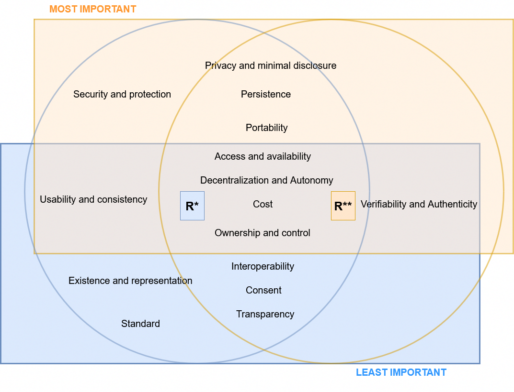
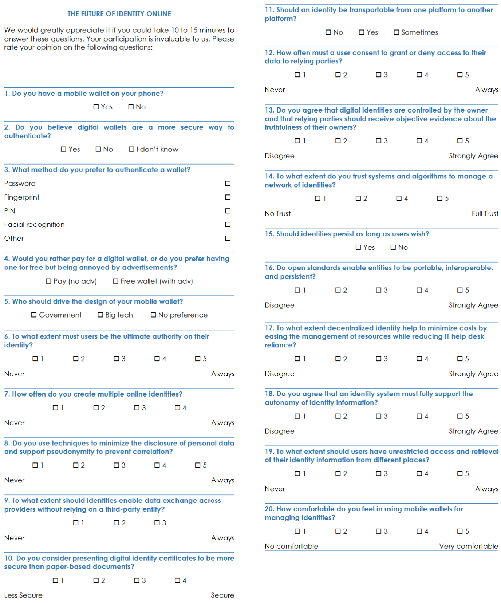

# 1. Self-Sovereign Identity

Self-Sovereign Identity (SSI) is an innovative approach to identity management that empowers users with full control over their identities. With SSI, users can devide what information to share with whom. However, describing SSI as control of information is just a part of its essense; the rest incorporates several core principles. The first to frame a list of principles for SSI was Allen[^allen]; since its list, numerous academics and working groups have further refined and expanded upon them to create a more comprehensive list of properties. As of today, there is no agreed-upon list of what those properties are, nor their definition. This chapter shed light on the debate surrounding SSI and we aim to converge to a comprehensive list of principles. We provide rationale for those principles combining a quantitative and a qualitative analysis.

## 1.1 Background

In 2016 Allen defined the properties of SSI which include *Existence, Control, Access, Transparency, Persistence, Portability, Interoperability, Consent, Minimalization, and Protection.*[^allen] These properties reflects back to the way individuals mange their digital identity and share personal credentials.

The philosophy of SSI shares many similarities with the concepts of decentralized identity and borrows many of its technical elements. A couple of years later, the W3C[^w3c] proposed an archetype based on three key roles and a data flow consistent with the idea of SSI, which was promptly shared by other community projects like Sovrin.[^sovrin] The three entities were: issuer, holder, and verifier. Issuers provide data for holders, who collect claims and later present them as assertions to service providers. Assertions may consist of claims combined in various ways and formats. The roles within the data flow are not fixed; each entity can act as an issuer or a verifier depending on the context. For example, the holder may occasionally issue claims to the verifier, while the verifier can also issue claims to holders upon request. In some cases, a verifiable data registry, such as a blockchain registry or a certificate authority (CA), can be integrated into the model, as shown in Figure 1.

However, there is an intertwine between the concept of SSI and the underneath technology. While the principles of SSI have shaped the architecture proposed by the W3C, some studies have sought to position the principles of SSI within the proposed architecture.[^cucko] Positioning principles within the SSI data flow allows to put properties in prespective of a pragmatic application of properties, while opening to subsequent works, for example developing an assessment model based on SSI. To shed light on the positioning of properties, we have investigated information from [^cucko], the Trust Over IP Foundation [^toip], the W3C,[^w3c] and the Architecture and Reference Framework v1.4.1 of the EUDI Wallet solution,[^ARF] with the hope of building the most comprehensive image of the Allen properties within the SSI architecture. The position of properties is consistent with the information from [^cucko]. Although we did not infer anything else, the position of these principles refers only to Allen’s principles and does not fit other definitions of SSI from other authors. Furthermore, the use of a registering CA - or another form of centrally managed or decentralized repository - can be replaced with a different type of trust anchor to validate certificates.

As other authors have proposed a different set of principles and definitions, we aim to analyze their contributions and converge to an agree upon set of properties.


*Figure 1: Systematic positioning of Allen's properties within the SSI process workflow.[^allen]*

## 1.2 Related works

Several contributions experimented with Allen's principles in an attempt to find a set of properties for SSI. Some of these contributions show significant disagreement on the set of principles, their definition, and categorization across authors and community groups. The following is a summary of eighteen contributions considered in this work. We believe this analysis is instrumental in building further analyses on SSI-based solutions.

In 2016, a work from the Sovrin Foundation[^tobin] was among the first to redefine Allen's principles while keeping their original names. Over the years, the Sovrin Foundation continued to foster its contribution to SSI principles, providing two further versions of its principles. Their latest version extends Allen's principles with eleven new properties while sharing only five of the original properties from Allen.[^sovrin] Inspired by this work, the Trust Over IP Foundation built on top of it.[^toip] Other contributions from academia replicated the same exercise of Sovrin, providing principles with the same names as Allen but different definitions,[^muhle][^pava] and shrinking the principles to a core set of core aspects.[^sheldrake] A business-oriented analysis outlined Personal Data and Usability.[^BlockTechDiVer] Other contributions include technical considerations,[^ferdous][gilani2020survey] and social analyses.[^andrieu] Satybaldy's extensions focus on trust, privacy, and usability,[^satybaldy] while the European project eSSIF-Lab defined six core principles to drive the adoption of SSI technology in Europe.[^essif] Finally, a review of Identity and Access Management requirements led to 15 new principles based on efficiency and effectiveness.[^glockler]

Eleven of the eighteen works considered in our contribution complement the list of principles through a categorization of the properties. For example, the first document from the Sovrin Foundation gathered principles into a three-way taxonomy of Control, Portability, and Security [^tobin], to eventually rename their categories in their latest draft document [^sovrin]. Controllability, Security, and Portability are instead the categories used in [^pava]. Andrieu categorized principles into Control, Acceptance, and Costs [^andrieu]. Security, Operability, Technology, and User are the four categories described in [^glockler]. The seventeen principles from [^ferdous] were grouped into Foundational, Sustainability, Security, and Flexibility, and a similar categorization was done by [^gilani2020survey]. These diverse categorizations are the result of different definitions of principles and different focus of the content analysis. Besides outlining differences in the naming of principles and categories, this summary highlights the effort of diverse subjects to converge on a core idea for SSI.

## 1.3 Methodology

A coarse-grained overview of the research topic provides a comprehensive perspective of works on the SSI principles. An initial selection of 18 works from the literature review outlined 52 properties, which were then filtered throgh heuristics. In addition to the list of properties, our work introduces a novel categorization of principles based on heuristics. Finally, we proposed a questionnaire for experts to: I) Investigate the identified SSI properties and assess their importance. II) Identify the most and least critical properties, including non-repudiable ones. III) Validate the grouping of properties. IV) Refine the principles.

To gather relevant articles, we conducted a systematic review, which provides a structured overview of a research field by adapting the steps presented in [^lepore][^badzek][^cushman].

*1. Defining search strings.* We formulated the research question *RQ1: What are the principles of Self-Sovereign Identity?* From RQ1, we extracted keywords and create the following search string:

- *"Self-Sovereign Identity" AND "principles"*

Keywords were refined and shuffled to avoid wildcards; for instance, Self-Sovereign Identity was replaced with SSI.[^lepore]

*2. Searching.* Search strings were used to retrieve papers from databases, including ACM, ArXiv, IEEE Xplore, Scopus, and the meta-search engine Google Scholar. This process yielded 47 results.

*3. Screening.* Abstractss were reviewed to exclude results not concerning with our research question RQ1. Duplicate entries were removed. The final selection consists of 18 papers published from 2016 to 2024.

*4. Recording of properties.* We extracted 52 property labels from the literature and organized them into a table to provide a comprehensive overview.

*5. Merge.* Some properties had similar meanings but were labeled differently by different authors. The merging process allows for merging labels that represent identical properties. The output is a list of 34 properties.

*6. Selection.* We have extracted the most relevant properties using a heuristic.

*7. Categorization.* We propose a categorization of properties that illuminates the relationship between the principles and Self-Sovereign Identity.

*8. Definition of principles.* We summarized the definitions of properties from authors while retaining their essence.

*9. Expert validation.* We proposed a questionnaire to investigate the identified SSI properties and assess their importance. The outcome served also to refine their definitions.

*10. Final list.* We framed the final list of properties, accompanied by precise definitions for each.


*Figure 1. The process of our literature review. Squares putlines the main process. Rounded squares are outputs. In the process, the output feeds the next step.*

The next part complements the discussion of steps 4 to 10, with insights and analysis through charts created in Python and available at the following repository: https://cristianlepore.github.io/Self-Sovereign-Identity/. Static visualization are created through the `pyplot` module, which is imported from the `matplotlib` library. A convention is to adopt alias as `plt` to make function calls more concise, such as `plt.plot()` and `plt.show()`. Finally, `import numpy as np` imports the `numpy` library, which is a numerical computing library used for handling arrays and performing mathematical operations efficiently. Again, we used the alias `np` to make function calls shorter (e.g., `np.array()`, `np.arange()`).

Together, these libraries are frequently used in data visualization and analysis tasks, where `numpy` helps manipulate data and `matplotlib.pyplot` is used to plot it.

### 1.3.1 Recording of properties

Table 1 summarizes the names of the properties and contributions identified through the search and screening process. The rows represent principles of SSI, while the columns correspond to contributions. Our literature review examined a total of 18 relevant works in the field of identity, covering 52 properties. The checkmarks indicate the properties addressed by the respective author(s). Notably, some works propose alternative sets of principles, and variations in naming conventions can be observed across different authors.

[Click to view the table 1.](https://cristianlepore.github.io/Self-Sovereign-Identity/definition/tables/principles/Principles1.html) *Comparison of identified properties in various sources.*
[Table 1 alternative version.](https://cristianlepore.github.io/Self-Sovereign-Identity/definition/tables/principles/Principles2.html) *Alternative view of Table 1. It conveys the same information.*

### 1.3.2 Merging

Difference in the naming of properties across various authors can be observed. However, many of these properties convey the same or similar meanings. To avoid pitfalls, we have consolidated property labels based on previous works by [^cucko][^sovrin][^toth][^stokkink][^ferdous][^andrieu]. This resulted in the following merges: (i) Existence and Representation, (ii) Ownership and Control, (iii) Ownership and Choosability, (iv) Access and Availability, (v) Portability and Secure Identity Transfer, (vi) Interoperability and Compliance, (vii) Consent and Participation, (viii) Protection and Secure Transactions, (ix) Protection and Security, (x) Protection and Counterfeit Prevention, (xi) Minimization and Privacy, (xii) Minimization and Disclosure Minimization, (xiii) Usability and Consistency, (xiv) Consistency and Recoverability, (xv) Decentralization and Autonomy, (xvi) Provability and Identity Assurance, (xvii) Provability, Verifiability, and Authentication, and (xviii) Identity Assurance and Identity Verification.

This approach aligns our list with established terminology in the field of identity, and ensures a coherent naming across works. Additionally, we slightly adjusted the work of [^cucko] to reflect updates in a more recent literature review. Specifically, we removed the properties of Equity and Inclusion, as well as Recoverability. Furthermore, we renamed Legacy System with Compliance; we eliminated the links between Control and Agency, Access and Usability, and Availability and Recoverability. Figure 2 visualizes the results through a Causal Loop Diagram based on these papers. The diagram includes only the properties subject to modification or merging.


*Figure 2: Casual loop diagram of the set of properties, defined by different authors.*

The merging process has collapsed some of the principles naming together and shrinked the list by 34%, leading to a total of 34 principles. The new list, presented in [Table 2](https://cristianlepore.github.io/Self-Sovereign-Identity/definition/tables/principles_semplification/Principles_semplification2.html), shows that Allen's principles are, on average, shared by 13 out of 17 authors, while the remaining 24 principles are shared by fewer than 2 authors on average.

[Click to view the table 2.](https://cristianlepore.github.io/Self-Sovereign-Identity/definition/tables/principles_semplification/Principles_semplification2.html) *Comparison of identified properties grouping from various sources.*

| **Category**                          | **Frequency** | **Authors** |
|---------------------------------------|-------------------|-------------------|
| Allen's principles   | ≈ 80% of authors | ≈ 13 autors |
| Extending 24 principles  | < 10% of authors | < 2 authors |

### 1.3.3 Selection

The chart in Figure 3 illustrates the frequency of citation for the 34 principles across the studies that we have considered, distinguishing between *Allen Principles* (in blue) and *Extending Principles* (in yellow). The x-axis lists the principles, while the y-axis represents their frequency of occurrence. The *Allen Principles*, such as "Existence and Representation," "Ownership and Control," "Transparency," and "Interoperability, show a significantly higher occurrence, indicating a strong foundation in existing literature, maybe based on the fact that those principles have been around for longer. In contrast, the *Extending Principles*, including "Cost," "Scalable," "Trust," and "Verifiability and Authenticity," show greater variability; for example, 19 out of the 24 extending principles, were cited by fewer than five authors. The analysis suggests the centrality of the Allen Principles which remain dominant, while emerging principles contribute to the evolving discourse in the field.


*Figure 3: The distribution of principles.*

The average value of citation occurrences is 27%, where we placed a red threshold line as a reference for comparison (we used 25% for simplicity). We used this threashold line to extract a subset of principles for SSI; namely, we selected principles cited by at least the 25% of the authors. This heuristic of 25% is a typified strategy that aids in making decisions efficiently by relying on practical rules.[^heuristic] Thus, the final list includes principles that surpass the red threshold in Figure 3. The final list is reported in [Table 3](https://cristianlepore.github.io/Self-Sovereign-Identity/definition/tables/principles_semplification/Principles_semplification1.html), and accounts for 15 principles - 10 from Allen plus five extending principles. Note that the merging process has collapsed some of the original names within the same cell. As a conclusive statement, we are aware that cutting principles at 25%, the work of some author may result incomplete. However, a shorter list of principles opens for a comparative analysis of their distribution.

[Click to view the table 3.](https://cristianlepore.github.io/Self-Sovereign-Identity/definition/tables/principles_semplification/Principles_semplification1.html) *The final list of properties and their namings.*

A shortened list of principles allows for a comparative analysis of their distribution in publications. For example, Figure 5 highlights the number of principles addressed by various authors. The x-axis indicates the frequency of principles covered, while the y-axis lists the authors. Notably, "Čućko et al."[^cucko] leads with the highest number of occurrences, showcasing extensive engagement with SSI principles. Other contributors, such as Allen, Sovrin, and eSSIF-Lab, demonstrate significant but slightly lower levels of coverage.[^allen][^sovrin][^essif] Conversely, other authors reference fewer principles, suggesting either a more selective approach or a narrower research scope.[^sheldrake][^andrieu] Overall, the chart underscores the varying levels of emphasis placed by different authors, with some offering comprehensive contributions while others take a more focused approach.


*Figure 4: The number of principles by author.*

The information presented in the previous charts (Figure 3 and Figure 4) is further detailed in Figure 5, which provides an overview of the distribution of principles across studies. Unlike the earlier charts, this one offers insights into the alignment of various authors with these principles. The rows represent different authors or studies, while the columns correspond to specific principles such as transparency, interoperability, and decentralization. Blue dots indicate which principles each author addresses.

A key highlight of this chart is the clustering of dots around principles like transparency, interoperability, and privacy, which most contributors clearly consider essential. In contrast, principles such as cost, decentralization, and usability receive less attention, suggesting they are either less emphasized or considered secondary by many.

Some authors address a broad range of principles, demonstrating a comprehensive approach, while others focus more narrowly, emphasizing specific areas of interest. This chart not only reveals the priorities of individual authors but also illustrates broader trends in the SSI field, offering insights into what is most valued as this framework continues to evolve.


*Figure 5: The distribution of principles and authors.*

### 1.3.4 Categorization
A category is useful to "*illuminate a relationship between the subjects and objects of knowledge.*"[^mahalakshmi] In our case, the subjects and the objects are the principles and the SSI field respectively. However, a category is featured by attributes or specific properties that must be described at priori. In our case, past studies categorized the SSI principles as reported in the [Related Works](#12-related-works), but they missed to provide criteria for their content analysis. For this reason, our first goal is to analyze past studies to see if aggregated results may exhibit similarities of behaviours from authors, and categorizations.[^rai] Once done it, we aim to extract common features and categorize principles based on these features. Instrumental for this analysis is the creation of [Table 4](https://cristianlepore.github.io/Self-Sovereign-Identity/definition/tables/principles_classification/Principles_classification1), which outlines the categories from our literature review.

[Click to view the table 4 with 15 properties only.](https://cristianlepore.github.io/Self-Sovereign-Identity/definition/tables/principles_classification/Principles_classification1) *The principles and their categories.*
[Table 4 with the complete list of 34 properties.](https://cristianlepore.github.io/Self-Sovereign-Identity/definition/tables/principles_classification/Principles_classification2) *The principles and their categories.*

The knowledge provided in Table 4 is scattered and we proceeded by aggretgating data, and structuring the knowledge through the following WH questions:[^villiers]

1. What are the most frequently discussed categories in the context of Self-Sovereign Identity?
2. How many articles process each category?
3. How many principles per category?
4. How many categories are relayed by each author?
5. How are principles distributed across categories?

Figure 6 answers the first question, Figures 7 addresses the second and third question. Finally, Figure 8 addresses the remaining questions.

The first chart that we present highlights the distribution of principles across categories, emphasizing key areas of focus and identifying gaps. The X-axis represents categories of principles, which reflect the thematic or conceptual groupings of principles. Each category is represented by a vertical bar whose height corresponds to the number of occurrences for that category. The Y-axis indicates the frequency or count of principles observed or identified within each category. The scale starts at 0 and increases in equal intervals (e.g., 5, 10, 15, 20), representing the number of occurrences. Higher bars along the Y-axis signify categories with more occurrences of principles, while shorter bars correspond to categories with fewer occurrences. For example, "Security" has the highest occurrence, followed by "Controllability", reflecting their critical role in building trust and establishing the core framework for SSI systems. Moderately emphasized categories, such as "Portability," "Sustainability," and "Usability," suggest attention to practicality and user experience. Finally, "Agency," "Compliance," and "Zero Cost" indicate potential areas for further exploration. Modest representation in "Adoption" and "Technology" signals their growing importance as SSI solutions transition toward broader implementation. Privacy, while essential, appears less explicitly emphasized, possibly being subsumed under broader principles like security. Overall, the chart reveals the dominance of "Controllability" and "Security" concerns while highlighting underexplored aspects that may shape future SSI research and development.


*Figure 6: Occurrence of principles per category.*

As next study, we aim to analyze how many unique principles are processed in each category. As opposed to the previous chart, this time, we do not count all occorrences of principles, rather only those listed once within a category. We compare this information with the number of articles processing each category. Through this chart, we get insight into which categories are most frequently discussed in literature and compare them with the number of principles within the category. This may pave the road for the extraction of features about potential gaps, overlaps, or priorities in research.

The blue bars indicate the occurrences in formal principles of SSI, with the red bars representing occurrences in academic or technical articles. This layout allows for a clear comparison about the frequency each category is addressed in these two distinct sources. For example, "Personal data" is cited only by one article (red bar), but contains 6 different principles (blue bar).

"Security" stands out as the most referenced category in articles, with 8 occurrences, and accounts for 5 different principles. Similarly, "Sustainability" receives more attention in articles (7 occurrences) than in principles (5 occurrences). "Controllability" and "Foundational" express similar emphasis in both articles and principles.

Moderately represented categories, such as "Usability" and "Agency", exhibit comparable but slightly varying occurrences between articles and principles. In contrast, less-referenced categories, including "Zero-cost," "Acceptance," and "Compliance," have minimal mentions across both articles and principles.  

This chart underscores the alignment and divergence in focus between the articles and principles. Likewise the previosus chart, it highlights key areas like "Security" and "Controllability" where articles place greater emphasis and identifying underexplored categories that could benefit from further research and integration. This chart also delivers the information that 11 categories (more than 50%) are cited by one article only, but we do not know how many of their properties are shared with others. For this reason, we aim to study this information in the next chart, through the following questions: *How many categories are relayed by each author? How are principles distributed across categories?*


*Figure 7: The number of distinct principles and articles per category.*

The bubble plot provides a comprehensive overview of how various authors address different categories by mapping the number of principles they cover. The Y-axis lists the authors, such as Allen, Čučko et al., Stokkink and Pouwelse, and others, while the X-axis features categories like "Controllability," "Foundational," "Personal Data," "Sustainability," "Security," "Usability," and more. Each bubble represents the number of principles an author has discussed in a specific category, with the size of the bubble visually indicating the magnitude. Larger bubbles signify a greater number of principles, while smaller bubbles represent fewer principles. The exact count of principles is also displayed inside each bubble, providing precise data for analysis.

The chart reveals significant patterns and trends as both articles and number of principles. Certain categories like "Controllability," "Foundational," "Sustainability", "Portability", and "Security" receive substantial attention, as evidenced by larger bubbles for authors such as Gilani et al. In contrast, categories like "Acceptance," "Zero-cost," "Compliance," and "Privacy" are sparsely addressed. Few or no bubbles appear in these areas, indicating limited focus by the authors.

The chart also reveals additional insights into the number of categories per author. By reading per rows, it delivers the number of categories presented by authors. For example, some authors provide many categories, reflecting a broad and comprehensive approach to SSI. Among them, Čučko provides six categories, Ferdous five, and Sheldrake one. On the other hand, other authors, such as Naik and Jenkins, Stokkink and Pouwelse, Allen, etc., did not convey any categorization, and they preferred to focus only on the defintion of principles. Finally, this visualization provides valuable insights into the distribution of attention among different categories and authors, helping to identify both heavily discussed topics and underexplored areas. It also emphasizes the pivotal role of authors in shaping discussions across critical categories, especially those with the most significant bubbles.


*Figure 8: Distribution of principles across categories by authors.*

##### Main takeout

The study of literature highlighted how scattered the domain of interest is and how loosely connected the principles, categories, and authors are. We failed to outline features for categorization, but we discovered common trends: "Controllability," "Foundational," "Sustainability", "Portability", and "Security" receive substantial attention. On the other hand, "Acceptance," "Zero-cost," "Compliance," and "Privacy" are sparsely addressed.

In the absence of features for categorization, we can leverage a clustering technique to identify groups and assign names based on heuristics. Clustering is equivalent to breaking the graph into connected components, one for each cluster.[^rai] Clustering helps uncover similarities between objects that initially appear dissimilar, finding arbitrary shaped clusters, with a minimum input requirement. To achieve this, we treat our data as a set of points where each point is closer (or more similar) to one or more other points.[^rai]

#### Clustering techniques
We aim to divide data into groups of similar objects by aligning principles and categories through the lens of author mentions. Traditionally clustering techniques are not straightforward, nor canonical, so we have compared three different clustering techniques described in [^bishop][^park][^saxena][^rai]: Greedy,[^park] K-Means,[^saxena][^rai] and Graph clustering.[^saxena] We selected a local Greedy for its simplicity, K-Means for its ability to minimize intra-cluster distances and convenience in working with numericar values. Finally, the Graph clustering represents clusters as graphs. However, they all have limitations that we will discuss in the different subsections; for example, the K-Means has limitation in handling outliers and  Graph clustering in detecting overlapping clusters.[^saxena] We finally compared results from the three different techniques to decide our final groups.

##### A) Greedy clustering
The greedy is a heuristic method that assigns points to clusters in a greedy fashion, making decisions based on the best immediate (local) choice at each step.[^bishop] It is simple and ease of use, often based on a similarity or distance metric. It can be easy to apply by visualizing data on a heatmap, as in Figure 9. Our heatmap illustrates the alignment of principles and categories through the lens of author mentions. It is visualized as a matrix, where the intensity of blue represents the frequency of author mentions. Principles are listed along the rows, while categories span the columns. The values in each cell indicate the number of authors supporting a specific combination. A gradient from white to dark blue represents the range of values, from 0 (no mentions) to 7 (highest mentions).


*Figure 9: Author mentions across principles and categories.*

###### Applying the greedy clustering
The greedy approach clusters rows from Figure 9 that minimize the Euclidean distance. The Euclidean distance is the straight-line distance between two rows.[^simson] It is not the only heuristic for matrices, other distances, such as Cosine similarity [^Rahutomo] and Jaccard similarity [^Ivchenko], can be applied. However, the Euclidean distance is simple to compute between two vectors **v** and **w** in an n-dimensional space:[^smith]

$$
d(\mathbf{v}, \mathbf{w}) = \sqrt{\sum_{i=1}^{n} (v_i - w_i)^2} \quad \text{(1)}
$$

Where:
- \( \mathbf{v} = (v_1, v_2, \dots, v_n) \) is the first vector.
- \( \mathbf{w} = (w_1, w_2, \dots, w_n) \) is the second vector.
- \( d(\mathbf{v}, \mathbf{w}) \) represents the Euclidean distance between the two vectors.

Processing on the heatmap of figure 9 is not straigthforward. Thus, we created the index matrix for the Euclidean distance as in Figure 10, calculated through the formula (1). The 50th percentile divides our dataset into equal halves.

- $50^{\text{th}}$ percentile $= 5.2$

In this case, the darkest cell - representing the highest value - lies at the intersection of "Security and protection" and "Security." From there, we move up and down within the same column, selecting principles that close the gap, namely "Persistence," "Privacy and minimal disclosure," and "Verifiability and authenticity." These principles form the "Security" category, named after the column.


*Figure 10: Euclidean distance between rows.*

We then repeat the process, moving to the first column and selecting the two rows with the highest values. Continuing to move up and down, we include the closest value: "Existence and representation." This group is named after its corresponding column: "Controllability." The final list of groups is presented in Table 5, along with a comparison of the other clustering results.

###### Discussion and limitations
Although the greedy approach is efficient and effective for certain problems, it has a rigid structure that relies on the next local best step to find a locally optimal solution, while it may not account for the overall problem structure.[^rai] Since we do not know the data distribution, a locally optimal solution may differ from the globally optimal one.[^park] Furthermore, the greedy approach lacks backtracking or global adjustments - it considers only the present step without planning ahead, which can lead to suboptimal results. Therefore, we aim to explore alternative, not greedy, techniques that have a less rigid structure and may lead to different clusterings.

##### B) K-Means
K-Means is an iterative method that can find a local minimum but has a less rigid structure compared to a purely local greedy. It generates partitions form initial centroids and minimize the intra-cluster distances; namely, the distance between objects of the same cluster.[^rai] It is popular for its simplicity and works conveniently with numerical attributes.[^rai] The letter k in K-Means represents the number of centroids, and is a parameter defined at priori. The K-Means iterates as follows:[^saxena]
1. Initialization: Choose the number of clusters K. 
2. Select k random points as initial centroids. These points represent initial group centroids.
3. Calculate the objects distance to centroids.
4. Group the objects based on their minimal distance.
5. Repeat steps 2 and 4 until the centroids no longer move.

This produces a separation of the objects into groups from which the metric to be minimized can be calculated.

Despites K-Means is simple to use, it lacks of an efficient and universal procedure to tune the value k for clustering.[^rai] Hence, to test various values of k, we have created a program as in the [Appendix A](#appendix-a-k-means-clustering-program-explanation), that instantiates the K-Means by using a specific `init='k-means++'` method to strategically initialize the centroids. While testing different values of the parameter k, we have collected results and plot different charts for discussion. All results are reproduceble because tests have been carried out using the same seed to generate the centroids. Thus, anyone can download the program, the input file from the dispatcher and obtain our same results.

We reinforced the knowledge on the dataset by answering the following WH questions about manner (how), choices (which), and time (when):[^villiers][^robinson]
1. How do clusters change as the parameter *k* varies? *(discussed in Figure 10)*  
2. How many principles belong to each cluster? *(discussed in Figure 10)*  
3. Which principles demonstrate the most stability or volatility *(discussed in Figure 11)*  
4. How often do principles move? *(discussed in Figure 11)*  
5. How do the principles evolve across groups? *(discussed in Figures 12)*
6. When do principles transition to another cluster? *(discussed in Figures 13)*  

Finding an answer to these questions is instrumental to tune the parameter k and figure out the best set of clusters.

The chart in Figure 10 illustrates the behavior of clustering as the parameter k increases. It answers the two questions (*How do clusters change as the parameter k varies? How many principles belong to each cluster?*) through the blue and red line. (1) The blue line represents the factual number of clusters formed, which grows linearly with k, while (2) the red line depicts the number of principles that change clusters, reflecting the stability of cluster assignments. The x-axis shows the values of k, and the y-axis indicates the respective counts.

Two regions are visible in the chart:
- Underfitting (low k): At smaller k values, the clustering is too coarse, with fewer clusters (blue line), resulting in significant instability as evident from the high fluctuations in the red line. This suggests that the model fails to represent the diversity in the data, grouping dissimilar data points together.

- Overfitting (high k): At larger k values, the blue line indicates the continuous growth of the number of clusters, often splitting even similar data points into separate clusters. While the red line stabilizes (indicating fewer changes in group assignments), the excessive number of clusters reduces the model's ability to generalize, leading to over-fragmentation and a loss of interpretability.

Let's put this in perspective of our two lines blue and red.

The **blue line**'s linear increase demonstrates how the clustering algorithm forces the creation of more clusters as k grows. At low k, there are too few clusters to capture the natural groupings in the data, leading to an underfitting scenario. As k rises, the number of clusters becomes more appropriate (indicated by reduced changes in the red line), achieving better data representation in the optimal range.

However, at higher values of k, the continued growth in the number of clusters becomes problematic. Aftermath k=9, even subtle differences between data points are treated as distinct clusters. This suggests that while the clustering is stable, it is no longer meaningful, as the algorithm starts splitting existing natural clusters unnecessarily, leading to overfitting.

The balance between these two extremes (underfitting and overfitting) is achieved in the optimal range for k, where the blue line grows moderately, and the red line shows minimal fluctuations. This range ensures the clustering effectively captures the data's structure without over-complicating it.

The **red line** provides critical insights into cluster stability. At low k, clustering is too coarse, leading to instability in group assignments as shown by the fluctuating red line. The red line fluctuates significantly, indicating frequent changes in cluster assignments. This instability occurs because the number of clusters is too small to represent the data’s underlying structure accurately, forcing the model to assign principles inconsistently. As k increases, the red line stabilizes, suggesting an optimal range for k where clustering balances stability and complexity. This improvement results from the clustering algorithm better capturing the data's structure with additional clusters. Beyond this range, in the overfitting region, the clustering becomes overly granular, increasing the number of clusters unnecessarily while the red line flattens, indicating few or no changes in cluster assignments. Despites this reflects high stability, it coincides with an excessive number of clusters (blue line), leading to over-fragmentation that captures noise rather than meaningful patterns.

**Discussion on questions 1 and 2**
The optimal range for k lies where the red line stabilizes after significant fluctuations, but before reaching the overfitting region. This range represents a balance between cluster stability and meaningful grouping. Together with the blue line, the red line helps identify a k value that provides consistent and interpretable clustering results.


*Figure 10: Analysis of clustering stability and complexity as k varies.*

**Discussion on questions 3 and 4**
The next chart in Figure 11 answers questions: *which principles demonstrate the most stability or volatility? How often do principles move?*
Finding an answer to these questions help to differentiate stable principles from volatile ones and identify optimal ranges of \( k \). The chart illustrates the behavior of principles as the parameter \( k \) changes. The x-axis represents the values of \( k \) (ranging from 1 to 15), while the y-axis lists the principles, such as "Portability," "Transparency," and "Privacy and Minimal Disclosure." The number in parentheses next to each principle indicates the total occurrences of group changes for that principle across all k-values. Blue dots mark specific \( k \)-values where a principle changed its group compared to the previous step. Principles with higher occurrence numbers, like "Standard" (5) and "Interoperability" (5), show multiple group changes, making them highly dynamic and sensitive to \( k \). Conversely, principles like "Persistence" (0) exhibits complete stability, showing no group changes across all \( k \)-values, indicating its less sensitiveness to variations in \( k \). Some principles, like "Transparency" and *"Ownership and Control," show sporadic changes across \( k \)-values, while others, like "Cost" and "Cost" exhibit concentrated changes within specific \( k \)-ranges, suggesting thresholds where they become less stable. Certain \( k \)-values, such as \( k = 2, 4, 8 \), see multiple principles changing groups simultaneously, indicating critical points of restructuring. This chart provides insights into the dynamic behavior of principles as \( k \) varies, highlighting stability with \( k \) ranging from 5 to 7, and volatility in group membership before and after these values.


*Figure 11: Principles vs. parameter \( k \): occurrences of group changes.*

A further analysis concerns the study of the evolution of principles across groups as a function of the parameter \( k \). As usual, \( k \) values ranging from 1 to 15 on the x-axis and group indices on the y-axis. Each principle is represented by a uniquely colored line. Most lines show a general upward trend as \( k \) increases, indicating incremental changes across groups. Some principles, like "Decentralization and Autonomy" and "Verifiability and Authenticity," show irregular variations, suggesting group-specific dependencies. Meanwhile, principles such as "Standard" and "Transparency" display consistent growth patterns. The differing slopes and intersections highlight varying priorities and potential conflicts or alignments of principles across groups.

The unique feature of this chart is to highlight two important information. (1) Two principles shift back and forth between just before steps 8. This may indicate that centroids start to "attract" principles inconsistently. Even though we lack information about the exact positioning of our data in space, this information could indicate instability in the clustering process. (2) A second notable aspect is the presence of numerous steep vertical lines crossing the grid after step 7. This phenomenon may lead to an over-framing of the dataset.

**Discussion on questions 5**
Before step 5, principles pursue a recognizable path to clustering. After step 5, clustering induces different behaviors among principles, for example vertical steep and back and forth behaviours. Based on this observation, we believe that \( k \)=5 is an appropriate choice to balance between underfitting and overfitting in our clustering approach. However, we want to investigate this option further through a dynamic behavior of principles, as they are grouped into clusters.


*Figure 12: Evaluation of Principles across groups.*

This kind of information is shown in figure 13, with each colored line representing a principle, and its position indicating its cluster at a specific \( k \). The transitions of lines reflect changes in cluster membership. Parallel lines represent a desirable behavior, while deep, steep vertical lines indicate principles that have been reassigned to a new cluster due to a high volume of centroids.

**Discussion on questions 6**
Before step 4, the movement of lines reflects the gradual grouping of principles. For example, between steps 3 and 4, the large number of lines moving upward and downward illustrates this phenomenon. Step 4 shows little adjustment. After step 5, one line, followed by more, gradually moves upward, crossing multiple lines in the grid. This phenomenon becomes particularly noticeable from step 7 onward, where a few lines from the bottom rise to the top of the chart. This final behavior is undesirable, as it suggests over-segmentation. For this reason, we have confirmed our previous decision to use k=5 as a tradeoff betweeh a good grouping exercise and an excessive number of clusters.


*Figure 13: Dynamic flow of principles among clusters.*

###### Clusters

We set the parameter k=5 to the [program](#appendix-a-k-means-clustering-program-explanation) to render fie groups. However, to assign a name to each category, we have mapped research articles across principles and categories. We do not discuss further this chart because it conveys the same information of Figure 9. Bubbles indicate the number of articles, with larger bubbles representing more studies.

Rectangles are in proximity of larger bubbles, which represent more citations from authors. To pick the name for the cluster, the largest bubble in the frame projects a horizontal line that feeds the category - the category name shared by the largest number of authors. For example, the name for the first three principles will be "Controllability," while the second group will be called "Portability," followed by "Security," "Sustainability," and "Usability." This procedure allows us to have groups and names for clusters that are consistent with the literature.


*Figure 14: Map of principles and categories.*

###### Final thoughts
Besides the lack of an efficient and universal method to tune the value of k, our analysis led us to identify five groups of principles, which have been named based on past literature works. Despites the K-Means is influenced by the shape, size, and density of clusters,[^saxena][^rai] the number of clusters has been tuned through a comprehensive analysis of the dataset with the lens of the parameter k.

To gain a better understanding of the data space, we use another clustering technique before concluding with a comparison of Greedy, K-Means, and Graph clustering.

##### C) Graph clustering
Graph clustering represents points as vertices connected by edges. The edges are weighted based on the number of instances of articles from authors. For example, if three articles use the category 'Controllability,' the corresponding edge will have a weight of three. While this method is visually appealing and easy to understand, it does not scale well to hundreds of nodes.


*Figure 15: *


*Figure 15: *

Figure 3 shows the final result of our grouping process. The group's name is derived from the literature.

TABELLA DI CONFRONTO 

*Figure 4: The final grouping.*

### 1.3.4 Definition of principles

We have combined the definitions of principles from 18 works, condensing them for quick comprehension while preserving their essence. This merging was done by referring to the authors' definitions as summarized in [Table 2](https://cristianlepore.github.io/Self-Sovereign-Identity/definition/tables/principles_semplification/Principles_semplification2.html). By combining definitions from at least two authors, we aimed to give a concise defintion. In some cases, we encountered similar definitions from more than two authors. To ensure consistency during the merging phase, we used uniform wording and synonyms. For example, we standardized the terms "users", "individuals", and roles like "holder" by referring to them as "entities."

| Property | Definition |
|----------|----------|
| Ownership and Control | Entities must have full control and ultimate ownership of their Self-Sovereign Identity. This includes secure algorithms that maintain the validity of the identity and its claims, whether self-asserted or issued by a third party.[^allen][^ferdous] | 
| Existence and Representation | Entities must be able to verify their existence by presenting attributes to service providers and generating multiple identities as needed.[^allen][^sheldrake] |
| Privacy and Minimal Disclosure | The SSI solution should not include any method for associating biometric data with an underlying identity. Personal and confidential identity-related data should only be shared with the owner’s consent, and only the minimum necessary information should be shared with third parties.[^naik][^toth] | 
| Interoperability | Identities  should  be  as  widely  usable as possible.[^stokkink] The systems shall enable digital identity data for an entity to be represented, exchanged, secured, protected, and verified interoperably.[^toip][^allen] | 
| Security and Protection | The security of an identity and its related communication is paramount for any SSI solution. The system must prioritizing censorship-resistant methods that promote individual rights and freedom through cryptographically secure connections and communications.[^naik][^pava] |
| Portability | Identities must be portable. Entities should be able to securely transfer or move their identity data to agents or systems of their choice.[^cucko][^glockler] |
| Consent | Entities must provide explicit consent for the collection, use, and sharing of their identity data, with the option to opt in or opt out at a later time.[^cucko][^allen] |
| Verifiability and Authenticity | Entities should be able to reliably prove their identity.[^cucko] Any identity should be verifiable through its credentials on the Web, in a manner similar to how a physical credential represents a real-world identity.[^naik] |
| Transparency | Systems and algorithms must be transparent.[^stokkink] The systems used to manage and operate a network of identities should be open, both in terms of their functionality and in how they are managed and updated.[^allen] |
| Persistence | Identities must be long-lived. A self-sovereign identity must ensuring that identities endure for as long as needed by the owner.[^pava][^allen] |
| Standard | A self-sovereign identity must be based on open standards to ensure maximum portability,[^cucko] interoperability and adoption as well as sustainability.[^ferdous] | 
| Cost | An identity should be provided to general users free of charge, with no hidden costs, licensing fees, or other financial charges.[^naik] Any proposed standard for self-sovereign identity must be adoptable at an extremely low cost.[^andrieu] | 
| Decentralization and Autonomy | A Self-Sovereign Identity must enable complete autonomy in managing and administering identity information, without relying on a centralized system to represent, control, or verify an entity's digital identity data.[^sovrin][^essif][^ferdous] | 
| Access and Availability | Identity must always be available to entities, which in turn must have unrestricted access to their identity information. Entities should be able to retrieve all information, including claims and assertions.[^ferdous][^tobin] | 
| Usability and Consistency | Entities should be able to count on a consistent experience across various technology platforms and services, with the system prioritizing the usability and accessibility of agents and other SSI components.[^satybaldy][^sovrin] |

### 1.3.5 Expert validation

To validate the proposed principles, we conducted a survey targeting experts attending the digital identity keynote at the ARES Conference 2024, held from July 29 to August 2 in Vienna, Austria. In parallel to a survey, we considered other methods of gathering input from participants, for example interviews. Despite the need for careful design to achieve a good response rate,[^ward] we preferred surveys over interviews because they allow participants to share their opinions without bias or fear of judgment, making them more likely to select their preferred options freely.[^mol] Additionally, since ARES is an international conference, conducting interviews in English could introduce biases due to language barriers, wording issues, and potential misunderstandings. Time was another critical factor we considered. Indeed, conference attendees may not have been willing to dedicate significant time to interviews. In contrast, a survey could reach a broader audience and allow participants to complete the questionnaire at their convenience. Due to these factors, we ultimately opted for a survey.

Participants were approached in person and asked to complete an online questionnaire.

The purpose of a survey was to gain a broader understanding of the perception of the SSI concept and its associated properties. Specifically, we invited respondents to complete an online questionnaire to: I) Investigate the identified SSI properties and their importance. II) Identify the most and least critical properties, including non-repudiable ones. III) Validate the classification and grouping of properties. The survey aimed to assess the perceived importance of these properties, highlighting the most and least critical ones. Additionally, by gathering expert insights, we sought to uncover any overlooked concerns, inconsistencies, misunderstandings, or missing properties in our analysis.

**Methodology**
The ARES Conference hosted the *International Workshop on Emerging Digital Identities**.[^ares] At the entrance to the hall, just before the keynote on identity and Self-Sovereign Identity started, a QR code was distributed to participants. By following the link, on a voluntary basis, participants were invited to electronically answer a list of 20 questions designed to evaluate the properties of SSI and gather insights into their definition. At the end of the survey, a final question asked respondents to provide their name or remain anonymous. The online questionnaire, created using Microsoft Forms,[^microsoft] was available throughout the entire conference, from July 29 to August 2, 2024. At the end of the available period, we collected the results and analyzed the responses.

**Questionnaire structure**
The questionnaire consisted of two parts. The first five questions aimed to familiarize participants with the candidates' knowledge of identity, while the remaining fifteen questions were designed to validate the SSI properties. While a similar contribution from [^cucko] in the field of SSI required respondents to go through a review process of SSI principles definitions, this led to 38.6% of respondents dropping out of the questionnaire before finishing. We aimed to minimize dropouts as much as possible. According to [^ward], survey response rates depend on the topic, the number of questions, and the time required for completion. We identified a tradeoff between the number of questions and the duration of candidate engagement. Fourteen percent of dropouts occur with a 10-minute engagement, while this percentage rises to 20% at 15 minutes, and it continues to increase as the number of questions grows.[^ward] Therefore, we aimed to keep our survey completion time between 10 and 15 minutes. To achieve this, we embedded brief definitions of key principles directly within the questions, ensuring respondents remained aware of them throughout the process. At the same time, we carefully summarized the definitions to maintain clarity and accessibility for a broad audience in the field of identity. We estimated an average of 40 seconds per question through local testing. However, this is only a cruel estimate.

Each question is designed by extracting keywords from the definition of principles and using them as the main drivers for formulating the question. Then, each question measured the respondents' perceived level of importance using a Likert scale.[^south] The Likert scale consists of one or more statements or questions accompanied by a range of response options. The scale values typically range from (i) Strongly Disagree, (ii) Disagree, (iii) Neutral, (iv) Agree, and (v) Strongly Agree, or they may also be interpreted as (i) Irrelevant, (ii) Slightly Relevant (Unnecessary), (iii) Moderately Relevant (Useful), (iv) Relevant (Desirable), and (v) Very Relevant (Mandatory).[^joshi] In our case, we maintained the same five-point scale but adapted it to fit the questions while preserving the intended meaning for respondents. In this regard, Figure 4 presents a template of a Likert scale questionnaire with three questions, each offering different response options.


*Figure 4: A Likert scale consists of a series of Likert items, each accompanied by numbered response options and text anchors.*

Various aspects of Likert item construction can influence how participants interpret and respond to a questionnaire, including the number of response options, the text anchors assigned to each option, and the numerical values associated with each response. There is no universally ideal approach for all situations; rather, the appropriate design of a Likert item depends on the specific context of the study. Key considerations in constructing the scale include: (i) Number of choices – The response options available to participants. (ii) Text anchors – The written descriptors accompanying each numeric response option. (iii) Question phrasing – The wording of the statements to which participants respond. (iv) Numerical representation – The characteristics of the numbers used to differentiate response options.

Reporting the design of the Likert scale is crucial for enabling future replication studies. Without detailed descriptions of Likert scale implementations, it would be impossible to determine whether contradictory results from a replication study genuinely refute the effect found in the original study or if participants simply responded differently to the questions. For this reason, within the questionnaire was attached a document explaining how to handle the Likert scale along with the questionnaire. Both can be found in [Appendix A](#appendix-a) of this report. The questions represent the factual questionnaire presented at the conference.

Questions can be divided into two groups. On the one hand, the first five questions are intended to gather insights on wallet usage and business models. On the other hand, the remaining 15 questions are designed to evaluate principles. In this case, we used a different Likert scale with five or fewer points.

**Pitfalls**
As mentioned, one of our objectives was to balance the number of questions with the time required to complete each one, aiming to maintain a high response rate. However, we did not measure the dropout rate in our analysis. Due to our deliberate choice to keep the survey short, we did not track participants' job positions, roles, or affiliations. Furthermore, the number of respondents (27) constitutes a relatively small sample. A larger sample would certainly strengthen the study.cIn the future, further efforts should be made to complement this work with comprehensive data collection, including tracking the dropout rate.

**Partecipants composition**
A total of 27 respondents completed the survey in full but chose to remain anonymous. We report insights from three types of questions regarding survey completion time, wallet usage, and business models for wallet and service deployment.

Survey completion time: on average, respondents took 11.48 minutes to answer all questions. The quickest respondent took slightly less than 10.30 minutes, while the longest completion time was about 15 minutes. The timing is considered only when the webpage is open. This means that if a person leaves the survey and returns a few hours later, only the time of active engagement on the platform is counted. Figure 5 shows the completion time and the frequency of participants who completed the survey within that time. The vertical axis represents the occurrence of participants, while the horizontal axis represents the length of time required to complete the survey.

Regarding wallet usage, more than 50% of respondents hold an identity wallet, and 37% believe wallets are more secure than traditional authentication mechanisms. Among wallet users, fewer than 45% use wallets to present online certificates.

As for business models of wallets and service deployment, 48% of respondents would like to see direct government involvement in the deployment of identity wallets, while 59% would like governments to contribute to developing the necessary infrastructure. The majority of respondents expressed a preference for paying for an identity wallet rather than receiving advertisements.


*Figure 5: shows the completion time and the frequency of participants who completed the survey within that time.*

**Results and discussion**
The breakdown of responses to the 20 questions in the questionnaire is available in [Appendix B](#appendix-b).

[Table 5](https://cristianlepore.github.io/Self-Sovereign-Identity/definition/survey/Survey.html) shows the results of respondend related to the 15 proposed properties and their ranking based on the avarage and the standard deviation.

[Click to view the table 5.](https://cristianlepore.github.io/Self-Sovereign-Identity/definition/survey/Survey.html) *Ranking of identified properties.*

The figure below shows a breakdown of the votes for each property.


*Figure 6. Perceived level of importance for properties.*

The most and least important properties, as well as their intersection, is presented below.


*Figure 7. The most and least important properties of both rankings.*

As last think, we have leveraged the findings from our survey to analyze the importance of clusters. For this objective, we have assigned a weight to the properties in the most important and least important frames. A weight of three to the most important properties, and one to the least important properties. As a consequence, a weight of two is assigned to properties at the intersection of the two frames.

Hence, we go through the five clusters, sum up results for each property and normalize to obtain a comparable result.

Controllability:  
| Property | Weight |
|-----------|-----------|
| Consent | 1 |
| Existence and representation | 1 |
| Ownership and control | 2 |
| AVG | 1.3 |

Security
| Property | Weight |
|-----------|-----------|
| Persistence | 3 |
| Privacy and minimal disclosure | 3 |
| Security and protection | 3 |
| AVG | 3 |

Usability and Agency
| Property | Weight |
|-----------|-----------|
| Decentralization and Autonomy | 2 |
| Usability and consistency | 2 |
| Verifiability and Authenticity | 2 |
| AVG | 2 |

Mobility
| Property | Weight |
|-----------|-----------|
| Access and availability | 2 |
| AVG | 2 |

Sustainability and Adoption
| Property | Weight |
|-----------|-----------|
| Cost | 2 |
| Interoperability | 1 |
| Portability | 3 |
| Standard | 1 |
| Transparency | 1 |
| AVG | 1.6 |


*Figure 8. The most and least important group according to our survey.*

SCRIVERE IL GRAFICO 3 CON IL CONFRONTO CON I PRECEDENTI PAPERS.

### 1.3.6 Final defintion of properties

The definitions presented in [Section 1.3.5](#135-refining-principles) were abbreviated as much as possible intentionally, due to their use in the questionnaire. In this Section, we want to enhance them in accordance with the results of the respondents, as we obtained valuable insights from experts in the fields of IdM and SSI, expressing their concerns and possible misunderstandings of an individual property. 

As a result of the survey, properties that received at least one vote as irrelevant have been modified or simplified (access and availability, cost, verifiability, and authenticity). Properties for which 50% of voters did not consider them at least desirable have been removed (usability and consistency). Meanwhile, the remaining properties were subject to minor or no modifications. Those that were modified did not lose specificity or consistency; rather, the purpose was to simplify their content. The following table reports the our final list of properties. Changes are bold, while the parts that need to be removed are crossed out.

| Property | Definition | Classification |
|----------|----------|----------|
| Existence ~~and Representation~~ | **Entities must have an independent existence.** They should be able to create as many identities **as required** and must be able to prove their existence through the assertion of attributes to services. | Controllability |
| ~~Ownership and~~ Control | **Entities must control their digital identity and corresponding personal data.** They can directly manage their attributes, including control the negotiation of attributes from the agent/wallet to the service provider. | Controllability |
| Consent | Entities must give deliberate consent for the collection, use, and share of identity data. Additionally, they should be able to ~~opt-in and~~ opt-out for consent **at a later date**. | Controllability |
| Persistence | ~~Individuals'~~ Identity must persist as long as the users wish, remaining valid over that period regardless of the identity provider. **To achieve this, individuals must be able to self assert attributes as well as receive attributes potentially from multiple sources.** | Security |
| Security ~~and protection~~ | Entities should be protected by the use of the most cutting-edge technology against suppression or invalidation of the list of attributes, as well as identity providers and service providers. | Security |
| Privacy **protection**~~and Minimal Disclosure~~ | The privacy of entities should be protected through the use of **technique that allow to minimize the disclosure of personal information**. | Security |
| Access ~~and Availability~~ | Entities must have unrestricted access to the list of identity providers and service providers. **They must be able to retrieve information about those entities.** | Mobility |
| Transparency | **The identity system, algorithms,** policies, rules, and protocols to manage the ecosystem members must be **free, open-soure, well-known, and independent of any specific architecture**. | Sustainability | 
| Portability | **Identity must be portable.** Users must be able to carry and use their digital identity across multiple platforms and multiple jurisdictions. Attributes and architectures must be transportable to other domains and ecosystems. | Sustainability | 
| Interoperability | Entities must be able to interoperate across domains and not be limited to a specific domain. **Identities must be widely usable.** | Sustainability | 
| Cost | **Entities must be able to performe crucial operation without cost barriers.** Mechanisms for creating, maintaining, and sustaining the system should have minimal or no costs. | Sustainability | 
| Standard | An e-identity system must use globally recognized standards. | Sustainability |
| ~~Decentralization and~~ Autonomy | Entities should have autonomy over their identity data without relying on any third party. **They must be the only one being resposible for all operations about their identity.** | Usability | 
| Verifiability ~~and Authenticity~~ | Entities should be able to reliably verify users' identities and must provide proof of the authenticity of their personal data. | Usability |

As a last thing we position these principles within the same process flow of Figure 1. We used our new definition of principles.

INSERIRE I RANKING DELLE PROPRIETA4 ALL4INTERNO DI QUESTA IMMAGINE


*SSI properties mapped within the general SSI process flow.[^allen]*

## Appendix A: K-Means Clustering Program Explanation

### Overview

This Python program applies the K-Means Clustering algorithm to a dataset stored in a CSV file. The processed dataset is then saved with an additional column indicating the cluster assignment for each data point. The files are dispatched under the following repository: [/definition/program/clustering/kmeans/](/definition/program/clustering/kmeans/).

### Libraries Used

- `pandas` – For handling and processing tabular data.
- `sklearn.cluster.KMeans` – For applying the K-Means clustering algorithm.
- `numpy` – For handling numerical data.
- `os` – For handling file paths.

### Function: `kmeans_clustering(file_path, n_clusters)`

This function performs the following steps:

1. **Load Data:** Reads the CSV file into a pandas DataFrame.
2. **Select Numerical Columns:** Filters out only the numerical columns for clustering.
3. **Handle Missing Values:** Replaces NaN values with 0 to ensure compatibility with K-Means.
4. **Apply K-Means Clustering:**
   - Uses `KMeans` from `sklearn.cluster`.
   - Initializes clusters using the `k-means++` method.
   - Assigns cluster labels to each data point.
5. **Save the Result:**
   - Adds a new column named `Clustering` with the assigned cluster labels.
   - Saves the modified dataset as `Output.csv`.
   - Prints the count of data points in each cluster.

### Code Explanation

```python
import pandas as pd
from sklearn.cluster import KMeans
import numpy as np
import os
```

- Importing the necessary libraries.

```python
def kmeans_clustering(file_path, n_clusters):
```

- Defines the function, which takes the **file path** and the **number of clusters** as inputs.

```python
    data = pd.read_csv(file_path)
```

- Reads the CSV file into a pandas DataFrame.

```python
    numerical_columns = data.select_dtypes(include=[np.number]).dropna(axis=1, how='all')
```

- Selects only numerical columns and drops columns that contain all NaN values.

```python
    cleaned_data = numerical_columns.fillna(0)
```

- Fills any remaining NaN values with `0`.

```python
    kmeans = KMeans(n_clusters=n_clusters, init='k-means++', random_state=42)
    clusters = kmeans.fit_predict(cleaned_data)
```

- Initializes the K-Means model with `n_clusters`.
- Uses `k-means++` initialization for better convergence.
- Predicts cluster assignments for the dataset.

```python
    data['Clustering'] = clusters
```

- Adds a new column **Clustering** to the original dataset.

```python
    output_file = "Output.csv"
    data.to_csv(output_file, index=False)
```

- Saves the updated dataset as `Output.csv` without row indices.

```python
    print(f"Clustering completed! Results saved in: {output_file}")
    print(data[['Clustering']].value_counts().sort_index())
```

- Prints a success message and displays the count of data points in each cluster.

### Execution Block

```python
if __name__ == "__main__":
```

- Ensures that the script runs only when executed directly.

```python
    download_folder = os.path.join(os.path.expanduser("~"), "Downloads/SSI_principles/Definition/Program")
    file_path = os.path.join(download_folder, "Input.csv")
```

- Constructs the file path dynamically based on the user's home directory.

```python
    n_clusters = 5
    kmeans_clustering(file_path, n_clusters)
```

- Specifies the number of clusters (`k=5`) and runs the function.

### Output

- The script prints the message **"Clustering completed! Results saved in: Output.csv"**.
- Displays the count of data points assigned to each cluster.
- Saves the clustered data to `Output.csv`.

### Summary

This program efficiently applies K-Means Clustering to a dataset and saves the results. It is particularly useful for unsupervised learning tasks where grouping similar data points is required.

## Appendix A

A copy of the survey given to respondents at the International Workshop on Emerging Digital Identities at ARES 2024.[^ares]




## Appendix B

The breakdown of responses to the 20 questions in the questionnaire.


## References

[^cucko]: Čučko, Š., Bećirović, Š., Kamišalić, A., Mrdović, S., & Turkanović, M. (2022). Towards the classification of self-sovereign identity properties. IEEE access, 10, 88306-88329.

[^toth]: Toth, Kalman C., and Alan Anderson-Priddy. "Self-sovereign digital identity: A paradigm shift for identity." IEEE Security & Privacy 17.3 (2019): 17-27. 

[^smith]: Smith, Karl (2013), Precalculus: A Functional Approach to Graphing and Problem Solving, Jones & Bartlett Publishers, p. 8, ISBN 978-0-7637-5177-7

[^south]: South, Laura, et al. "Effective use of Likert scales in visualization evaluations: A systematic review." Computer Graphics Forum. Vol. 41. No. 3. 2022.

[^lepore]: Lepore, Cristian, et al. "A Model For Assessing The Adherence of E-Identity Solutions To Self-Sovereign Identity." World Conference on Information Systems and Technologies. Cham: Springer Nature Switzerland, 2024.

[^cameron]: Cameron, Kim. "The laws of identity." Microsoft Corp 12 (2005): 8-11.

[^allen]: Allen, Christopher. "The path to self-sovereign identity." Life with Alacrity (2016).

[^mahalakshmi]: Mahalakshmi, B., and K. Duraiswamy. "An overview of categorization techniques." International Journal of Modern Engineering Research (IJMER) 2.5 (2012).

[^villiers]: De Villiers, Jill. "Why questions?." University of Massachusetts Occasional Papers in Linguistics 17.1 (1991): 8.

[^ARF]: EUDI Wallet. Architecture and Rererence Framework v 1.4.1 https://eu-digital-identity-wallet.github.io/eudi-doc-architecture-and-reference-framework/1.4.0/ Accessed on December 28, 2024.

[^badzek]: Badzek, Laurie, et al. "Ethical, legal, and social issues in the translation of genomics into health care." Journal of Nursing Scholarship 45.1 (2013): 15-24.

[^cushman]: Cushman, Reid, et al. "Ethical, legal and social issues for personal health records and applications." Journal of biomedical informatics 43.5 (2010): S51-S55.

[^toth]: Toth, Kalman C., and Alan Anderson-Priddy. "Self-sovereign digital identity: A paradigm shift for identity." IEEE Security & Privacy 17.3 (2019): 17-27. 

[^toip]: Trust Over IP Foundation. Principles of self-sovereign identity (ssi). https://trustoverip.org/wp-content/uploads/2021/10/ ToIP-Principles-of-SSI.pdf, 2024. Accessed: 2024-12-24 

[^ferdous]: Ferdous, Md Sadek, Farida Chowdhury, and Madini O. Alassafi. "In search of self-sovereign identity leveraging blockchain technology." IEEE access 7 (2019): 103059-103079.

[^pava]: Pava-Díaz, Roberto A., Jesús Gil-Ruiz, and Danilo A. López-Sarmiento. "Self-sovereign identity on the blockchain: contextual analysis and quantification of SSI principles implementation." Frontiers in Blockchain 7 (2024): 1443362.

[^bokkem]: Van Bokkem, Dirk, et al. "Self-sovereign identity solutions: The necessity of blockchain technology." arXiv preprint arXiv:1904.12816 (2019).

[^omar]: Dib, Omar, and Baha Rababah. "Decentralized identity systems: Architecture, challenges, solutions and future directions." Annals of Emerging Technologies in Computing (AETiC) 4.5 (2020): 19-40.

[^glockler]: Glöckler, J., Sedlmeir, J., Frank, M., & Fridgen, G. (2024). A systematic review of identity and access management requirements in enterprises and potential contributions of self-sovereign identity. Business & Information Systems Engineering, 66(4), 421-440.

[^joshi]: Joshi, Ankur, et al. "Likert scale: Explored and explained." British journal of applied science & technology 7.4 (2015): 396-403.

[^microsoft]: Microsoft Forms. https://en.wikipedia.org/wiki/Microsoft_Forms, accessed on January 2nd, 2024.

[^ares]: International Workshop on Emerging Digital Identities (EDId). https://www.ares-conference.eu/edid, accessed on 2025-01-29.

[^andrieu]:Andrieu, Joe. "A technology-free definition of self-sovereign identity." Proc. 3rd Rebooting Web Trust Design Workshop. 2016. 

[^stokkink]: Stokkink, Quinten, and Johan Pouwelse. "Deployment of a blockchain-based self-sovereign identity." 2018 IEEE international conference on Internet of Things (iThings) and IEEE green computing and communications (GreenCom) and IEEE cyber, physical and social computing (CPSCom) and IEEE smart data (SmartData). IEEE, 2018. 

[^sovrin]: Sovrin Foundation. Principles of self-sovereign identity (ssi). https://sovrin.org/principles-of-ssi/, 2024. Accessed: 2024-12-2 

[^naik]: Naik, Nitin, and Paul Jenkins. "Self-sovereign identity specifications: Govern your identity through your digital wallet using blockchain technology." 2020 8th IEEE International Conference on Mobile Cloud Computing, Services, and Engineering (MobileCloud). IEEE, 2020.

[^sheldrake]: Sheldrake, Philip. "Generative identity—beyond self-sovereignty." 2019,

[^essif]: eSSIF-Lab Principles, https://essif-lab.github.io/framework/docs/essifLab-principles, accessed on 2025-01-29.

[^tobin]: Tobin, A., & Reed, D. (2016). The inevitable rise of self-sovereign identity. The Sovrin Foundation, 29(2016), 18.

[^satybaldy]: Satybaldy, A., Nowostawski, M., & Ellingsen, J. (2020). Self-sovereign identity systems: Evaluation framework. Privacy and Identity Management. Data for Better Living: AI and Privacy: 14th IFIP WG 9.2, 9.6/11.7, 11.6/SIG 9.2. 2 International Summer School, Windisch, Switzerland, August 19–23, 2019, Revised Selected Papers 14, 447-461.

[^ward]: Ward, C. D., Welch, B., Conley, A., Smith, P. J., & Greby, S. (2017). It’s About Time: Examining the Effect of Interviewer-Quoted Survey Completion Time Estimates on Survey Efficiency. Survey practice, 10(2).

[^mol]:Van Mol, C. (2017). Improving web survey efficiency: the impact of an extra reminder and reminder content on web survey response. International Journal of social research Methodology, 20(4), 317-327.

[^braun]: Braun, Christoph H-J., et al. "SSI, from Specifications to Protocol? Formally verify security!." Proceedings of the ACM on Web Conference 2024. 2024.

[^w3c]: Verifiable Credentials Data Model v1.1. W3C Recommendation 03 March 2022. https://www.w3.org/TR/vc-data-model/, accessed on 2024-02-01

[^simson]: Simson, Robert, ed. The elements of Euclid. Desilver, Thomas, 1838.

[^Rahutomo]: Rahutomo, Faisal, Teruaki Kitasuka, and Masayoshi Aritsugi. "Semantic cosine similarity." The 7th international student conference on advanced science and technology ICAST. Vol. 4. No. 1. South Korea: University of Seoul, 2012.

[^muhle]: Mühle, Alexander, et al. "A survey on essential components of a self-sovereign identity." Computer Science Review 30 (2018): 80-86. 

[^sheldrake]: Sheldrake, Philip. "Generative identity—beyond self-sovereignty." 2019, 

[^essif]: ESSIF-Lab. Essif-lab principles. https://essif-lab.github.io/framework/docs/essifLab-principles, 2024. Accessed: 2024-12- 24.

[^heuristic]: heuristic definition. Cambridge dictionary. https://dictionary.cambridge.org/dictionary/english/heuristic, accessed on 2024-02-03.

[^saxena]: Saxena, Amit, et al. "A review of clustering techniques and developments." Neurocomputing 267 (2017): 664-681.

[^rai]: Rai, Pradeep, and Shubha Singh. "A survey of clustering techniques." International Journal of Computer Applications 7.12 (2010): 1-5.

[^park]: Park, Dohyung, Constantine Caramanis, and Sujay Sanghavi. "Greedy subspace clustering." Advances in neural information processing systems 27 (2014).

[^bishop]: Bishop, Christopher M. Pattern recognition and machine learning by Christopher M. Bishop. Springer Science+ Business Media, LLC, 2006.

[^robinson]: Robinson, Joan. "What are the questions?." What are the Questions and Other Essays. Routledge, 2016. 2-32.

[^Ivchenko]: Ivchenko, G. I., and S. A. Honov. "On the jaccard similarity test." Journal of Mathematical Sciences 88 (1998): 789-794.
